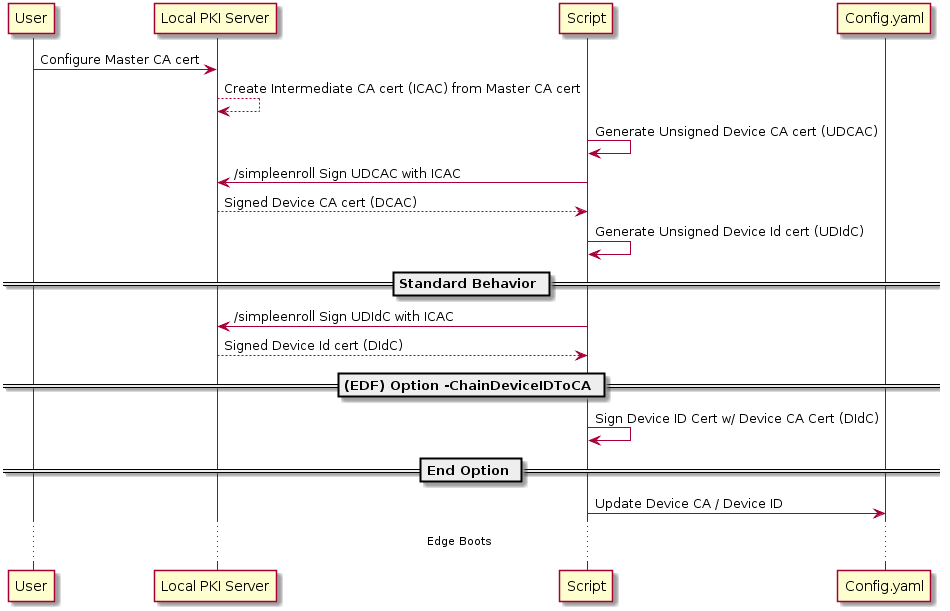

# Azure IoT Edge EST Script Enrollment

  

This script allows for Azure IoT Edge to enroll certificates using a CA living on an EST server. The script is designed to be run ahead of IoT Edge - it will generate and sign both the **Device CA** and the **Device ID** certificate.
  

# Overview

  

This script is deisgned to be run before the start of Edge. 

# Requirements 
1. Access to an EST server properly configured for the types of certificates the user wishes to produce. 
2. The TLS intermediate CA for the EST server (CURL limitation)
  

## EST Server Auth Modes

  The Aure IoT Edge EST scrpt can support the following auth modes:
  1. username:password based authentication
  2. certificate based authentication

Certificate based authentication is the chosen way for Edge to authenticate with the EST server. User:Pass mode is supported for development/demo purposes. 

  

## Device ID Signing Modes

  The Azure IoT Edge EST Script can support the following modes for signing the Device ID certificate:
  1. Sign via EST CSR - This is the reccomended path. This is also the **default** behavior of the script. 
  2. Sign via Device CA - This path signs the Device ID with the Device CA. Users need to pass the `-ChainIDToDeviceCA` flag to the script to enable this behavior.

  

## Certificate Placement

 Certificates will be placed in the output directory.

  

# Examples

**Example 1** - Default mode of operation 
`./est_cert_gen.sh -ServerBaseURL https://contoso.com:8443 -ServerUser username -ServerPass password -CertOutDir /var/foo/bar"`

**Example 2** - Signing the Device ID via Device CA
`./est_cert_gen.sh -ServerBaseURL https://contoso.com:8443 -ServerUser username -ServerPass password -CertOutDir /var/foo/bar -ChainIDToDeviceCA` 

  

# Notes on Cisco Demo Server

Cisco kindly provides the world with a free-to-use [demo server](http://testrfc7030.com/) to experiment with EST. While this is great for developer work, it does have some limitations and they are noted below:

* User:Pass is the *only* auth mode supported

* CA class certificates will not be issued by demo server

  

# Future Work Considerations

* Automatically edit the config.yaml file with certificate locations

* Allow for cert based EST server auth via CURL
