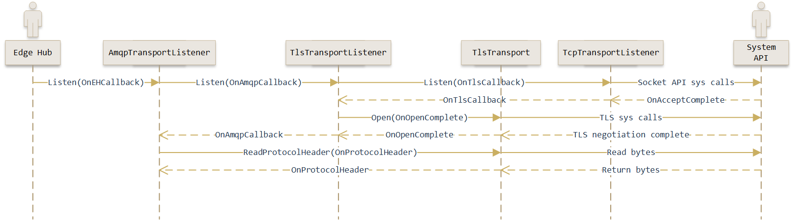
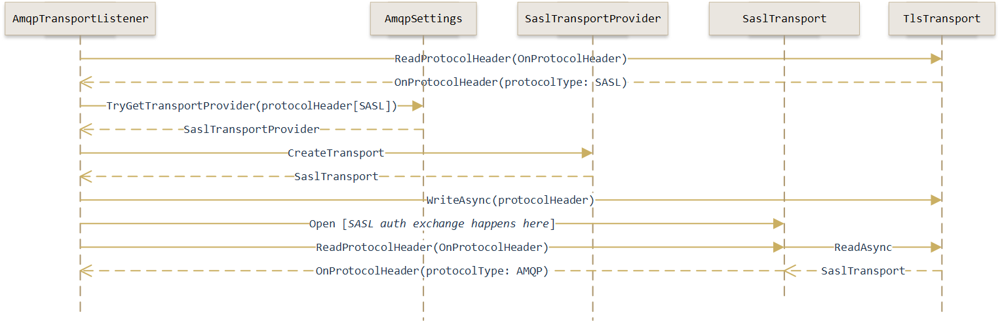

Edge Hub AMQP Head Bootstrap Implementation Notes
=================================================

Resources
---------
An awesome curated list of resources (including the AMQP specification itself)
is available here:
  > https://github.com/xinchen10/awesome-amqp

Overview
--------
Edge Hub supports AMQP connectivity just like IoT Hub does. It uses the
[Microsoft Azure AMQP for .NET](https://github.com/Azure/azure-amqp) library to
implement the AMQP protocol. This document captures some of the implementation
notes that might help understand how the AMQP protocol integration works in Edge
Hub. Specifically, this document talks about the protocol bootstrap integration
process.

Just enough AMQP
----------------
The AMQP protocol is quite open-ended in terms of choice of transport layer
protocols and security. AMQP can be stacked on top of:

  1. Plain TCP with no authentication
  2. Plain TCP with SASL authentication
  3. TLS over TCP with no authentication
  4. TLS over TCP with SASL authentication
  5. TCP with TLS upgrade and no authentication
  6. TCP with TLS upgrade and SASL authentication

The azure-amqp library supports all of these use cases.

### What's this TLS Upgrade?

It should be self-evident what "TLS over TCP" means. Briefly, it means that we
stack a TLS implementation on top of a TCP channel. In this case we can think of
the AMQP protocol as being "inside" a TLS over TCP channel, i.e., the TLS
negotiation has already successfully occurred by the time AMQP protocol frames
are exchanged.

The AMQP specification also supports a TLS scheme where the TLS channel is
"inside" an AMQP channel. Briefly, this means that the 2 containers (a
"container" in AMQP standardese is an application that implements AMQP)
initially exchange an AMQP protocol header that specifies how the channel should
be secured (or not secured). Here's what the header looks like (diagram sourced
from AMQP spec):

    4 OCTETS   1 OCTET   1 OCTET   1 OCTET   1 OCTET
    +----------+---------+---------+---------+----------+
    |  "AMQP"  |   %d2   |  major  |  minor  | revision |
    +----------+---------+---------+---------+----------+

The second octet in that header specifies the protocol to use and can have the
following values:

  * `0` - use AMQP
  * `2` - use TLS Upgrade
  * `3` - use SASL

When using "TLS Upgrade" this means that we use the value `2` for the protocol
ID and is interpreted to mean that a TLS channel should be established on the
same connection after the protocol header has been exchanged. Here's how this
interaction works (diagram sourced from AMQP spec):

    TCP Client                 TCP Server
    =========================================
    AMQP%d2.1.0.0  --------->
                  <---------  AMQP%d2.1.0.0
                        :
                        :
                <TLS negotiation>
                        :
                        :
    AMQP%d0.1.0.0  --------->                (over TLS secured connection)
                  <---------  AMQP%d0.1.0.0
            open  --------->
                  <---------  open

Note that a protocol ID of `0` does not necessarily mean no TLS encryption (even
though that is a valid configuration). It simply represents that AMQP frames
will henceforth be exchanged on whatever happens to be the underlying channel
which could be an un-encrypted TCP socket or a TLS channel or something else
entirely. In the interaction diagram above for example note that after the TLS
negotiation is complete, another protocol header packet is exchanged where the
protocol ID is `0`. But that exchange happens on top of a TLS secured
connection.

### SASL

SASL stands for _Simple Authentication and Security Layer_ and is an application
protocol neutral framework that defines how authentication and data security
should be implemented. SASL has a notion called "mechanism" which is a moniker
for a specific authentication scheme. Edge supports the *EXTERNAL*, *ANONYMOUS*
and *PLAIN* schemes.

  - EXTERNAL means that the authentication occurs using a scheme that is, well,
    external to the protocol (for e.g. IPSec or TLS client auth). In Edge, it
    looks like we need to treat EXTERNAL as being synonymous with the ANONYMOUS
    mechanism for backward compatibility reasons as at some point in the past
    EXTERNAL was used for implementing Claims Based Security (CBS).
  - ANONYMOUS essentially means "no authentication". In Edge we use ANONYMOUS
    when we want to use CBS. Briefly, CBS uses special AMQP links to establish
    an authentication context.
  - PLAIN means that a user name and password is used for authentication. This
    is used in Edge to implement authentication based on SAS keys.

When using SASL, the protocol identifier will have a value of `3`. Here's how
this interaction works (diagram sourced from AMQP spec):

    TCP Client                 TCP Server
    =========================================
    AMQP%d3.1.0.0  --------->
                  <---------  AMQP%d3.1.0.0
                      :
                      :
              <SASL negotiation>
                      :
                      :
    AMQP%d0.1.0.0  --------->                (over SASL secured connection)
                  <---------  AMQP%d0.1.0.0
            open  --------->
                  <---------  open

As before, this communication can occur over an un-encrypted plain TCP socket,
or an existing TLS channel.

Azure AMQP Library
------------------
It turns out to be useful to first briefly review the design of the Azure AMQP
library before getting into Edge Hub's implementation that makes use of it. Lets
begin our review by examining key types in the library that participate in the
bootstrap process.

  * Transport Listeners - represented by the `TransportListener` abstract type
  * Transport Providers - represented by the `TransportProvider` abstract type
  * Transports - represented by the `TransportBase` abstract type

Transport listeners and providers work in co-ordination to bootstrap the AMQP
protocol head. The library frequently makes use of the [decorator
pattern](https://en.wikipedia.org/wiki/Decorator_pattern) to compose objects in
a structure that often elegantly mirrors what the protocol specification
requires. For example when we want TLS over TCP, the implementation maps this
directly to having a _TLS transport listener_ object decorating a _TCP transport
listener_.

At a high level, it is useful to think of listeners and providers) as being
stacked on top of each other with the "listener" being stacked below the
"provider".

    +---------------------+
    | Transport Providers |
    +---------+-----------+
              |
              |
    +---------v-----------+
    | Transport Listeners |
    +---------------------+

### Transport Listeners

Transport listener objects are responsible for setting up the network transport
stack. The `TransportListener` type has an abstract method called `OnListen`.
Implementations of this method are expected to do the work necessary to commence
"listening" - whatever that might mean for that implementation. Instances of
`TransportListener` (i.e. of its concrete sub-types) are produced via
`TransportSettings` objects. We can think of `TransportSettings` as a factory
type responsible for manufacturing `TransportListener` objects. A
`TcpTransportListener` for example can be created using a `TcpTransportSettings`
object. Here's an example:

```csharp
TcpTransportSettings tcpSettings = new TcpTransportSettings()
{
  Host = "foo.azure-devices.net",
  Port = 5671
};
TcpTransportListener tcpTransportListener = tcpSettings.CreateListener();
```

The `TcpTransportListener` implements `OnListen` by opening up a TCP socket on
the specified port. We can stack a `TlsTransportListener` on top of a
`TcpTransportListener` using a `TlsTransportSettings` object. Using the
`TcpTransportSettings` object we created in the example above we can setup TLS
like so:

```csharp
TlsTransportSettings tlsSettings = new TlsTransportSettings(tcpSettings)
{
  Certificate = certificate,  // an X509Certificate2 object
  IsInitiator = false         // this means that we are the "server" and not the
                              // "client" in that only clients "initiate" things
};
TlsTransportListener tlsTransportListener = tlsSettings.CreateListener();
```

We can then further decorate the `TlsTransportListener` with an
`AmqpTransportListener` which is responsible for handling the AMQP parts of the
bootstrap process:

```csharp
var settings = new AmqpSettings();
// initialize "settings" here

var listeners = new[] { tlsTransportListener };
var listener = new AmqpTransportListener(listeners, settings);
```

When you invoke `AmqpTransportListener.Listen` it turns around and invokes
`Listen` on all the `TransportListener` objects we initialized it with. In the
example above it would delegate to `TlsTransportListener.Listen` which in turn
would delegate to `TcpTransportListener.Listen`. Here's a sequence diagram
depicting this flow.



The structure described above sets up an AMQP over TLS over TCP channel.

### Transport Providers

Once the transport listeners have done their job, control then passes to
transport objects created by the transport providers. In the sequence diagram
above, the message flow that occurs after the `AmqpTransportListener` has read
the protocol header has been skipped. The `AmqpTransportListener` inspects the
protocol ID field in the header (as described earlier in this document) and
instantiates a transport object from the appropriate provider that supports the
given protocol ID.

A `TransportProvider` is a simple factory type with an abstract method called
`OnCreateTransport` which concrete implementations are expected provide. This is
its signature:

```csharp
protected abstract TransportBase OnCreateTransport(TransportBase innerTransport, bool isInitiator);
```

This method returns a `TransportBase` object which implements a specific
transport. It is handed in a reference to a lower level transport via its
`innerTransport` argument. Transport provider objects are created and configured
via the `AmqpSettings` type. In the code snippet above we pass an instance of
this type to the `AmqpTransportListener` instance which subsequently uses it to
map the protocol ID read from the transport into a transport provider instance.

Here's an example that initializes the `AmqpSettings` object with transport
providers for handling SASL authentication and TLS upgrade apart from the AMQP
protocol itself.

```csharp
AmqpSettings settings = new AmqpSettings();

// Note below that we pass `null` for the underlying transport settings. This is
// because "TransportSettings" are not used by "transport providers" to create
// "TransportListener" objects. Transport providers are handed in an existing
// transport which they use to do their thing. This "null" is a consequence of
// the fact that we reuse "TlsTransportSettings" for both setting up
// "TlsTransportProvider" objects and for creating "TlsTransportListener"
// objects.
var tlsProvider = new TlsTransportProvider(new TlsTransportSettings(null, isInitiator)
{
    TargetHost = "foo.azure-devices.net",
    Certificate = certificate,            // an X509Certificate2 object
});
tlsProvider.Versions.Add(new AmqpVersion(1, 0, 0));
settings.TransportProviders.Add(tlsProvider);

// Setup SASL auth
SaslTransportProvider saslProvider = new SaslTransportProvider();
saslProvider.AddHandler(new SaslPlainHandler(new EdgeHubSaslPlainAuthenticator(userInfo, password)));
saslProvider.Versions.Add(new AmqpVersion(1, 0, 0));
settings.TransportProviders.Add(saslProvider);

// Setup AMQP transport provider
AmqpTransportProvider amqpProvider = new AmqpTransportProvider();
amqpProvider.Versions.Add(new AmqpVersion(1, 0, 0));
settings.TransportProviders.Add(amqpProvider);
```

And here's a sequence diagram that depicts what happens once the
`AmqpTransportListener` has read the protocol header from the underlying
transport listener.



The structure described above sets up a SASL authenticated AMQP over TLS over
TCP channel. You'll note in this sequence that it begins with a
`ReadProtocolHeader/OnProtocolHeader` call pair and ends with the same call
pair. The difference is that while the former was dealing with SASL, the latter
deals with AMQP. The control flow for AMQP is pretty much identical to the
sequence shown above except that instead of `SaslTransportProvider` we'd have an
`AmqpTransportProvider`.
