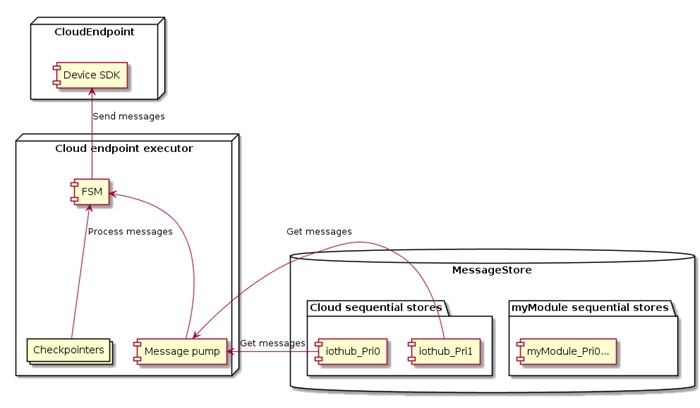

# Route priority and time-to-live

## Context
In environments where the upstream connection has limited throughput (e.g. cellular or satellite), often times certain critical data needs to take precedence over the mass of normal telemetry messages to ensure speedy delivery. Prioritized messages and TTL addresses this concern by letting the operator specify which routes will be processed first, and how long messages should be retained when offline.

## Glossary
|Term         | Description   |
|-------------|---------------|
|*Routes*     | Declarations used to specify how messages should be passed between modules, IoT Hub, and any leaf devices.|
|*Route-spec* | A route definition in the deployment manifest.|
|*TTL*        | Time-To-Live, used to specify how long before unsent messages expire in storage.|
|*FSM*        | Finite state machine.|

## Design details
Message priorities is a new property of message routes.  This is because, when given a set of messages, both the set definition and the endpoint are necessary for the priority to be meaningful, which naturally lends to associating priorities with routes.
This moves us towards a design where message routes not only define what messages goes where, but also when they'll be sent.

### Deployment manifest changes
Since message priority and TTL are associated with routes, the route section of the deployment manifest schema needs to be updated.  Routes are now objects, each containing properties for the routing string, the priority, and the TTL.  By baking the priority into the route-spec, the operator has the option of defining priority based on the module outputs, or by filtering for customer headers on the message.

|Property name      | Description           | Default Value             |
|-------------------|-----------------------|---------------------------|
|*route*            |The routing string, same as existing version. FROM *[source]* WHERE *[condition]* INTO *[sink]*     |Must be present    |
|*priority*         |UINT value specifying the priority for this route. 0-9, with 0 being highest priority. If more than one route has the same priority on the same endpoint, then messages are handled on a first-come-first-serve basis (existing behavior).|>10 (lowest priority)|
|*timeToLiveSecs*   |The TTL for this route, overrides the legacy value in *storeAndForwardConfiguration* |Inherits from storeAndForwardConfiguration |

For backwards compatibility, the legacy way of specifying routes as just a string property remains valid.  If a route is redefined by both the old and new format, then only the new format will be used.

For TTL, the property in storeAndForwardConfiguration section is now treated as the global TTL value, and can be overridden by the route specific TTLs.

<pre>
"routes": {
    "type": "object",
    "patternProperties": {
        "^[^\\.\\$# ]+$": {
            "anyOf": [
                {
                    "type": "string",
                    "pattern": "^.+$"
                },
                <b>{
                    "type": "object",
                    "required": [
                        "route"
                    ],
                    "properties": {
                        "route": {
                            "type": "string",
                            "pattern": "^.+$"
                        },
                        "priority": {
                            "type": "integer",
                            "minimum": 0,
                            "maximum": 9
                        },
                        "timeToLiveSecs": {
                            "type": "integer",
                            "minimum": 0,
                            "maximum": 4294967295
                        }
                    }
                }</b>
            ]
        }
    }
}
</pre>

### Example

<pre>
"$edgeHub": {
  "properties.desired": {
    "schemaVersion": <b>"1.1.0",</b>
    "routes": {
      "secCamAlerts": {
        "route": "FROM /messages/modules/SecCamMod/outputs/P0_Alerts INTO $upstream",
        "priority": 0,
        "timeToLiveSecs": 86400
      },
      "floorCamAlerts": {
        "route": "FROM /messages/modules/FloorCamMod/outputs/P0_Alerts INTO $upstream",
        "priority": 0,
        "timeToLiveSecs": 86400
      },
      "secCamData": {
        "route": "FROM /messages/modules/SecCamMod/outputs/P1_Data INTO $upstream",
        "priority": 1,
        "timeToLiveSecs": 1800
      },
      "upstream": "FROM /messages/* INTO $upstream"
    },
    "storeAndForwardConfiguration": {
      "timeToLiveSecs": 7200
    }
  }
}
</pre>

In this case, the upstream route is a “catch-all” to handles messages that are not explicitly routed with a priority.

### Components
The message forwarding stack in Edge Hub is currently abstracted into the following layers:
1. Protocol heads – receive messages from child modules and leaf devices, and translate the protocol-specific payloads into our own in-memory representation.
2. Routing – takes an incoming message, matches the message source and payload to determine the destination endpoint as specified in the deployment manifest.
3. Message queue/storage – takes a routed message and enqueues it into the destination endpoint's sequential store, then asynchronously pump messages out of the queue to be sent as connectivity allows.  This layer also deals with message TTL and cleans up anything past the expiration timestamp.
4. Endpoint – an interface backed by either a module endpoint, or the upstream cloud endpoint.  This layer utilizes with the device and module SDKs to actually send a message over the wire.

# Design decisions
As mentioned above, priorities and TTLs are handled when messages are sent.  For prioritized messages, it means some messages are sent earlier than others.  For route specific TTL, it means some messages might never get sent.  Both behaviors are best dealt with at the message queue/storage layer where our queue management can be made smarter.

To achieve this, the routing layer needs to pass more message context down to the message queue.  Currently, when EdgeHub twin changes come down with routes, they are compiled to yield only the destination endpoint.  With the aforementioned manifest changes, the in-memory Route objects now also contain the TTL and priority specific to that route.  Then as part of route evaluation, the returned value is a new object called *RouteResult*, which wraps all three pieces of data, and is passed into the endpoint executor.

In this design, the message routing and queue layers remain agnostic of the underlying endpoint implementations. This means even though message priorities primarily target the IoT Hub endpoint, message priorities on brokered endpoints is also enabled.

###	Handling priorities
The endpoint executor takes the provided context and expand the collection of sequential stores to be one per priority per endpoint.  When a new message comes in, the executor enqueues it into the sequential store that matches the endpoint and priority.  For naming, these new sequential stores take the endpoint ID, and append “_Pri[value]” to the end of the string, where *[value]* is the message priority this sequential store represents (e.g. “iothub_Pri0”, “iothub_Pri1”, etc).

On the message processing side, the message pump iterates messages from each sequential store in priority order.  At the end of every loop, the pump always reset back to priority 0 (or whichever is the highest) again.  This is so that high priority messages that come in while low priority messages are in-flight can still be processed in a reasonable timeframe.  This means low priority message can potentially be starved if the throughput is not enough to service all the higher priority messages.  However, this behavior is desirable based on known customer scenarios.

The message pump does not attempt to aggregate messages of different priorities into a single batch.  This is to guarantee that only one type of priority is processed at a time, which greatly simplifies the checkpointing requirements.
To process the messages from a given priority, a corresponding instance of Checkpointer is needed to keep track of failures and retries.  To accomplish this, the executor maintains a map of priorities to FSMs, the latter of which now contains the checkpointer specific to its queue.

### Handling TTL
As mentioned above, the TTL specific to a route is now available when a message gets stored.  This TTL value is a new property on the stored MessageRef object, so that it can be referenced when the message pump processes the message.

As the message pump fetches messages out of the store, the MessageStore checks the message enqueue timestamp against the TTL timespan on the message for expiration.  If the message has no TTL, then global TTL will be used.

If the message is expired, it simply gets skipped over, and GetNext() keeps on iterating until it fills the requested batch size or the store is empty.  Then in the background, the existing message cleanup task will periodically delete these expired messages.

#### Message clean up
With the addition of PriorityQueues, the CleanupProcessor assumptions change. Previously, we could always assume that if a message at the head of a queue should not be deleted, then none of the subsequent messages in the queue should be either. Now, because we can have different TTL’s for messages within the same queue, there can be messages that have expired in the queue after the head. The *checkEntireQueueOnCleanup* flag is an environment variable for edgeHub. If it is set to true, we will clean more aggressively, by checking the entire queue every time the cleanup processor runs. If it is set to false, we just remove the oldest items in the queue until we get to one that is not expired. 

This is currently a trade-off between I/O and memory, and different users will have different preferences. If users are not sending different TTL’s to the same endpoint, they should keep this flag off to save I/O. If they are, then they may want to turn this on to save memory.

### Live deployment manifest changes
A new deployment manifest can come down with routing updates while there are still pending messages in the store.  In this case, since the previous priority and TTL values are effectively snapshotted into the store, there will be no change to the behavior of pending messages.  Any new message that comes in after the manifest changes are applied will be enqueued with the new config.

### Data Migration
Since storage changes are additive, data migration is not needed.  We have fallback legacy values for everything we're adding, so if the newer logic encounters an old message, it should be able to handle it as normal.

### Security and Performance
None of the threat boundaries are changing with this feature, so there are no new security concerns.

There should also be no noticeable impact to performance, as the feature only changes the order in which messages are sent by categorizing messages in storage.  The added I/O will be trivial, and the fundamentals of message forwarding is preserved.

## Limitations
- Priority values can only be between 0-9 inclusive.
- In the case where a message has two different routes to the same endpoint with difference priorities, the route that yields the highest priority will be used.
- When changing priorities on an existing route, the updated priority will not apply to any message already received and stored by EdgeHub.