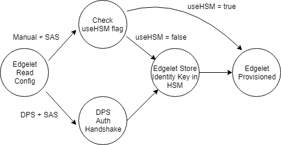

## Edge Provisioning

Edgelet needs device credentials to download the edge runtime and to manage device identities. These credentials can be manually configured on the device by a user or for a zero-touch experience, Edgelet can use the Azure Device Provisioning Service to securely obtain its credentials from the cloud.

Edgelet will support two modes of provisioning for both SAS and Cert workflows: 1. Manual and 2. DPS. The manual flow will work with both a hardware or software HSM. The Edge team will not be building support for DPS mode with a software HSM. The reason for not supporting DPS provisioning with a software HSM layer is that TPM concepts are buried in the DPS authentication flow. We don't want to spend time implementing TPM semantics in software so that we can authenticate with DPS. If it turns out that, we can fake TPM constructs for DPS authentication, we can explore this route.

**Open question**  
* Can we put some random number as EK in a DPS enrollment?
* Is mixed mode authentication - SAS token based for Edgelet and cert based for modules/downstream devices or vice versa, a valid scenario post GA?

Edgelet will reprovision itself each time it starts up. This is so that we don't have to store state indicating whether the device has been provisioned or not.

## DPS + Edge Spec

The DPS + Edge integration [spec](https://microsoft.sharepoint.com/:w:/r/teams/Azure_IoT/_layouts/15/WopiFrame.aspx?sourcedoc=%7B58227908-02BA-4C87-8FF5-8DBEB0EF5C91%7D&file=DPS%20%2B%20Edge%20integration%20spec.docx&action=default) has one high level goal for GA: Edge devices provision via DPS in a secure manner

To break this down further, lets look at the three ways a user can provision any device using DPS:
	1. User creates an individual enrollment and uses SAS Token based authentication
	2. User creates an individual enrollment and uses Cert based authentication
	3. User creates a group enrollment and uses Cert based authentication

Note: The authentication scheme used with DPS will always be the same as the one used with IoTHub. For example, if SAS Token based authentication is used with DPS, the same authentication mechanism will be used with IoTHub. It is not possible to do SAS based auth with DPS and cert based auth with the IoTHub or the other way around.

These three scenarios are also applicable to Edge devices and are prioritized as follows:
  
P0 - User creates an individual enrollment and uses SAS Token based authentication  
P1 - User creates a group enrollment and uses Cert based authentication  
P2 - User creates an individual enrollment and uses Cert based authentication  

## SAS: Flow

## SAS: Manual provisioning of device credentials 

### Assumptions
1. The user has access to the shared access key based connection string of the device

### Inputs to Edgelet
1. Connection string with host name, device Id and one of:  
	* **useHsm = true**  
		This option is not expected to be used in production with a dev_hsm_file implementation. If using dev_hsm_file implementation for testing, edgelet will expect the SAS key to be in $HSM_KEY_FILE. The most common case is that the user has run DPS outside of Edge and the SAS key has been stored in a TPM.
	* **SharedAccessKey=<primary/secondary device key>**
	
### Provisioning flow 
1. Edgelet reads its configuration file and determines that it is doing manual + SAS provisioning
2. Edgelet reads the connection string from its configuration file
3. If the user has provided the SharedAccessKey in the connection string, Edgelet calls hsm_client_activate_identity_key to store the key.  
    **dev_hsm_file implementation**
    * hsm_client_activate_identity_key stores the key at $HSM_KEY_FILE

    **dev_hsm_real_tpm implementation**
    * hsm_client_activate_identity_key stores the key in a real TPM

## SAS: DPS provisioning of device credentials

### Assumptions
1. The user has a TPM enabled device or has written some glue hsm implementation to talk to the MSR TPM simulator

### Inputs to Edgelet
1. DPS Scope ID
2. Enrollment Registration ID  
	**Open questions**  
    * Is it always possible for the user/buyer of an Edge device to obtain the registration ID of their device? What information is a manufacturer able to supply?
    * Should we mandate that the registration ID always be a SHA 256 of the TPM's EK?

### Provisioning flow
1. Edgelet reads its configuration file and determines that it is doing DPS + SAS provisioning
2. Edgelet reads its DPS scope ID and Enrollment Registration ID from its configuration file
3. Edgelet completes its DPS authentication using data from the HSM (namely EK)  
    **Open question**  
	* Does this data need to be TPM specific? Can it be fake values?
4. Edgelet obtains the host name, device Id and shared access key from DPS
5. Edgelet calls hsm_client_activate_identity_key on the shared access key
