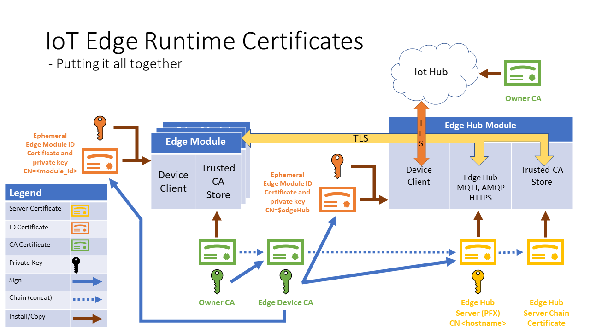

# Edgelet Security

A major focus of the Edgelet is security. This document goes into details of the various aspects
of securing the Edge runtime. The problem space is large and spans IoT Device SDKs running in
modules all the way down to OEM level integration. Security is further complicated because Edge
device platforms vary in their level of support for HSMs and have varying HSM interfaces.

* Here are the anticipated platforms:
  * Linux and Windows
  * HSM availability
    1. No HSM
    2. HSM backed only with a TPM
    3. HSM backed with a TEE with TPM
    4. Other possibilities (DICE etc.)

* **Note:** This document has been written keeping in mind that one of the deliverables of the
  Edge product is the 'Dev SKU' running the Edge runtime. The 'Dev SKU' by default is expected
  to run on a platform with no HSM but has the necessary tools to integrate with a platform
  with HSM capabilities. One can expect specifics about this SKU sprinkled throughout
  this document.

Overall this document describes:

* The authentication scenarios that the Edgelet has to handle and their corresponding requirements.
* Security requirements for provisioning the Edgelet using DPS or manually.
* Input configuration data required by the Edgelet to bootstrap the Edge runtime. This includes
  configuration input from:
  * A solution implementer using Edge (or a Dev SKU user)
  * OEM configuration
* Interfaces between Edge modules, IoT SDKs and Edgelet.

The content here builds upon the high level Secure Agent Architecture document [\[1\]](#references)
and references terms and concepts from this architecture document.

* Overall there are two authentication schemes applicable to the Edge runtime:
  * X.509 CA certificates [\[2\]](#references)
    * This means that the Edgelet and all modules are to use this for authentication with EdgeHub,
      IoTHub and DPS.
  * SAS token [\[3\]](#references)
    * This means that the Edgelet and all modules are to use this for authentication with EdgeHub,
      and IoTHub.
  * Note: X.509 Device certificate (or thumbprint flow) is not particularly useful for the Edge
    as module identities are created by the Edgelet at runtime. A much more natural fitting
    authentication scheme is X.509 CA.

* The authentication schemes are very much inline with the DPS [\[4\]](#references)
  X.509 CA and TPM provisioning flows.
  * Hybrid authentication schemes comprising SAS token, X.509 CA and X.509 Device (thumbprint)
    while theoretically feasible, is currently out of scope and will be addressed at a later time.

* ***Notes:***
  * For the purposes of this document, unless otherwise noted, certificates and
    private keys are in separate files and in PEM format.
  * Certificates contain their public key counterpart and are generally available and can be
    installed on host machines and within module containers.
  * In some instances, private key files are distributed to modules and in other
    cases, the private key(s) never leaves the HSM (if supported). In the HSM case,
    private key operations are performed using a named 'reference'.

## Contents

* [Edge Runtime Architecture](#edge-runtime-architecture)
* [Edge Authentication](#edge-authentication)
* [Edge Device Provisioning/De-provisioning](#edge-device-provisioning)
* [IoT SDK Custom HSM Interface](#iot-sdk-custom-hsm-interface)
* [Edgelet to HSM Interface](#edgelet-to-hsm-interface)
* [References](#references)
* [Appendix](#appendix)

## Edge Runtime Architecture

### Edgelet Architecture Block Diagram


**Note:** Container sidecar based solution is currently out of scope and will be addressed later.

### Edgelet Architecture Notes

* **Why do we need a RPC interface from Module <--> Edgelet? OR**
* **Why not access HSM (via some standardized interface) directly in the modules?**
  * To securely access/use credentials on the device, modules will need to interact with HSMs.
  * The goal for Edge modules is __package once__ and __deploy anywhere__
    ex. cloud servers/devices etc.
  * Given this, there is no way to package a set of libraries that work across all platforms.
    Additionally implementing logic within the container to select the 'right' library is untenable.
  * The Edgelet also takes on the ACL responsibilities to determine what module can access what
    secure resources (see next). This ACL would not be feasible when accessing HSMs directly.

* **What other options exist instead of Module <--> Edgelet RPC?**
  * A device driver interface could work that interacts with say a TPM. However for this to
    work, the device driver mount point ex. ```/dev/tpm0``` would have to be mounted into the
    module's container and we would have elevate the container to --privileged. Elevating a module's
    privilege level is essentially giving it 'root' access and this is not good for many
    security reasons nor would customers want to incorporate this in their solutions.
    * Edgelet could be implemented as a user mode driver (UMDF) and it would perform the necessary
      module ACL and wraps access to the HSM however this is arguably more complicated than a RPC.

* **Why GRPC?**
  * Many technologies were considered however GRPC [\[5\]](#references) is supported on many
    platforms we intend to target and it has wide general acceptance (Docker uses GRPC).
    While some RPC stacks are heavily geared for perf, portability is more of a concern for Edge.
    Finally, it has better documentation as compared to other similar technology stacks.

* **Interface between Edgelet <--> HSM**
  * There are many possible standard interfaces that OEMs/ODMs can provide to access the HSM
    on their platform:
    * Linux
      * OpenSSL (libssl and libcrypto) via an engine interface, provides all the needed APIs
        to access an HSM. This will be used for the Dev SKU on Linux.
      * WolfSSL
    * Windows
      * S-Channel

## Edge Authentication

Here is a listing of all certificates required to operate the Edge runtime and
Edge modules. Certificates in some form or another will be used in all authentication schemes.
This list is meant to account for every certificate
used per authentication scheme and the purpose it serves in the Edge runtime.
This list is likely to be updated over time.

### Certificates Summary

Name                                   | Auth Scheme  | Purpose    | Description and Functions
---------------------------------------|--------------|------------|:----------------------------------------------
Owner CA certificate                   | X.509 CA     | IoT Hub CA         | This is the CA certificate that is registered as the IoT CA certificate and it is the root of the Device CA chain. [\[2\]](#references)  |
Edge Device CA + Private key           | Any          | Device CA          | The Edge device CA certificate that is signed by the owner CA [\[2\]](#references). <br/> **Function(s)** <br/> - Primarily serve as the hardware root of trust. This is globally unique and its private key is tied down to the device. <br/> - This is a CA certificate as the Device certificate should issue (sign) other identity certificates rooted exclusively to the specific device.<br/> - What this implies, all identities that are created are tied down to device and no other entity. <br/> The above functions are key requirements for X.509 based auth however for SAStoken auth, a 'Device CA' is still needed in order to issue server certificates such as EdgeHub. |
Edgelet identity cert + private key    | X.509 CA     | IoT Hub Identity   | **Function(s)** <br/> - This is the identity certificate that the Edgelet will use to connect to IoTHub. <br/> - Edgelet will use it's device scope to determine the registry, registry credentials and Edge agent image to pull. <br/> - If DPS was used to provision the Edge, this cert is the *'Device leaf cert'* |
Edge Agent identity cert + priv. key   | X.509 CA     | IoT Hub Identity   | **Function(s)** <br/> Edge agent will use this to connect to IoT hub with $edgeAgent module scope. |
Edge Hub identity cert + private key   | X.509 CA     | IoT Hub Identity   | **Function(s)** <br/> Edge hub will use this to connect to IoT hub with $edgeHub module scope. |
Edge Module identity cert + priv key   | X.509 CA     | IoT Hub Identity   | **Function(s)** <br/> Edge module identity that a module will connect to the Edge hub using $moduleId scope. <br/>  - The Edge hub will validate this certificate using TLS client auth. |
Edge Hub Server Cert + Private key     | Any          | Local Network IO   | **Function(s)** <br/> - Edge agent TLS server endpoints certificate. <br/> - In essence the certificate backing the HTTPS, MQTT, AMQP ports. <br/> - For X.509 CA auth, server certificate can be issued by the Edge device CA. <br/> - For the SAS token auth, the server cert should be issued by an operator's signing CA certificate (see next). |
Edge Hub Server Cert Chain             | Any          | Local Network IO   | Chain of certificates the Edge hub server has to present for a successful TLS handshake. This includes the chain from Owner to EdgeHub.
Private registry CA certificates       | Any          | Registry Access    | For non public Docker image registries, this would need to installed out of band on the host so that the Edgelet can download Edge module images. |

### <a name="x509-ca-prerequisites"></a> X.509 CA Authentication Prerequisites

* For general information regarding this authentication approach see [\[2\]](#references).
* This section discusses the prerequisites needed for the Edgelet to use this authentication
  scheme and in turn enable this authentication scheme for Edge modules.
* For ALL Edge SKUs the availability of the following is required:
  * File system write access to a directory which will contain certificates, configuration files
    etc. all needed to bootstrap the Edge runtime.
  * Certificates
    1. Owner CA certificate
    2. Device CA certificate
    3. Owner to Device CA certificate chain. (There could be other intermediate CA certs
       leading up to Device CA certificate).
    4. Edgelet device cert
    5. Device CA Private Key access:
        * For HSM based devices, the requirement is that the Device CA private key should be
          available for Certificate Sign Requests (CSR) operations and must be referenced by name.
          The key name to be provided via input configuration (see the provisioning section later).

* Dev SKU approach to provide prerequisites

| Scenario             | Actions |
|----------------------|---------|
| Quick-start          | All these certificates and keys are created at first boot |
| Transparent Gateway  | Owner CA, Device CA, Device CA PK and Chain cert are all provided by the user. Everything else is created at first boot. |

<br/>

* The illustrations below show how the Edge runtime certificates are configured and used for the
  quick-start scenario.

<br/>



* **Potential blockers:**
  * With DPS, the Edgelet leaf device is registered with IoT hub using 'X.509 Device'
    not X.509 Device CA. What we need is modules identities are to be created using
    X.509 Device CA. This is primarily due to lack of support for CA authentication
    using Websockets and HTTPS.

### <a name="sastoken-prerequisites"></a> SAS Token Auth Prerequisites

* This section discusses the prerequisites needed for the Edgelet to use this authentication
  scheme and then in turn enable this authentication scheme for Edge modules.
* For ALL Edge SKUs the availability of the following is required:
  1. File system write access to a directory which will contain certificates, configuration files
     shared access keys etc. all needed to bootstrap the Edge runtime.
  2. Device scoped shared access key provisioned either in the TPM via DPS or provided by the user.
  3. Shared access key encrypted storage: (TBD PM scoping needed)
     * Access to a named key pair in order to encrypt module SharedAccessKeys and store on the
       filesystem. The name of the key is to be provided via input configuration.
  4. EdgeHub server certificate issued by the operator's signing CA certificate.

* Dev SKU approach to provide prerequisites

| Scenario             | Actions |
|----------------------|---------|
| Quick-start          | A device connection string containing the SharedAccessKey to be provided. All other certificates and keys are created at first boot |
| Transparent Gateway  | In addition to the connection string, the signing CA and signing CA PK and chain cert are all to be provided by the user. |

## Edge Device Provisioning

Edge device provisioning includes getting all the dependencies required by the
Edgelet to bootstrap the Edge runtime. Device provisioning is a prerequisite of
the Edge runtime and happens before Edgelet core executes.  De-provisioning involves
its corresponding tear down.

* For dev SKUs specifically this would entail obtaining configuration data from a operator/user for
  DPS (if enabled) and IoT Hub.

Here are the approaches for provisioning/de-provisioning:

* DPS based
  * Single enrollment
  * Group enrollment
* Manual

Provisioning includes providing the Edgelet with the following configuration data in order to
boot up and launch the Edge runtime.

* IoTHub hostname
* DeviceId
* Host directory needed for file I/O
* TLS and crypto library configuration
  * Ex: For OpenSSL engine name, path to libssl.so etc.
* Authorization scheme (X.509 CA or SASToken) and their corresponding prerequisites. To recap see:
  * [X.509 CA prerequisites](#x509-ca-prerequisites)
  * [SASToken prerequisites](#sastoken-prerequisites)

De-provisioning includes the following:

1. Deleting all Edgelet created configuration files, volumes, containers, networks
   and pulled docker images.
2. Shredding security assets private keys, certificates etc.

### DPS Based

* Provisioning
    1. DPS device enrollment takes place before the device is expected to operate.
       This is expected to be done by the customer before deploying the Edge device.
    2. Once DPS registration runs on the device and the expected output of the DPS
       registration should provide this information:
       * IoTHub hostname
       * DeviceId
       * Device capability (Edge enabled or not)
       * Authorization scheme

* De-provisioning
  * At this time, de-provisioning is manual. DPS does not provide any mechanism to Edgelet
    to 'uninstall' the Edge runtime. As a consequence it would seem that a factory reset
    is the only option available. This can be refined later when the feature is
    able to support this in an automated way.

### Manual

* Provisioning
  * An admin/user provides the provisioning information via a utility or configuration file.
    This is very much inline with the Edge public preview Transparent Gateway flow.
    This would also be applicable for the dev SKU and possibly how some brownfield
    devices will be provisioned.

* De-provisioning
  * This is straightforward and similar to public preview, use the configuration file
    to determine what needs to be deleted and delete the config file itself.

### Sample Input configuration

* Sample input configuration data needed to 'setup' of the Edgelet for dev SKU

  * Dev SKU with DPS enabled using X.509 CA
  ```json
    {
      "schemaVersion": "1",
      "deviceConnectionString": "",
      "homeDir": "host dir",
      "hostName": "hostname",
      "logLevel": "info",
      "crypto": { // configuration information an OEM would provide to use their TLS/crypto lib
        "cryptoProvider": "openssl",
        "openssl": {
          "libPaths": "/path1/to/libs:/path2/to/libs",
          "libNames": [
            "libssl.so",
            "libcrypto.so",
          ],
          // if this is null, no engine is used and keys can be read directly from filesystem
          "engineName": "pkcs11"
        }
      },
      "deployment": {
        "type": "docker",
        "docker": {
          "uri": "/var/run/docker.sock",
          "loggingOptions": {
            "log-driver": "json-file",
            "log-opts": {
              "max-size": "10m"
            }
          }
        }
      },
      "provisioning": {
        "source": "dpsClient",
        // this configuration here is expected to work for single and group enrollments
        "dpsClient": {
          // id registered in the portal for single enrollment or for group enrollment
          // this is what the device is programmed to set as the registration id
          "registrationId": "id",
          //default value
          "globalDeviceEndpoint": "global.azure-devices-provisioning.net",
          // obtained from DPS instance in the portal
          "scopeId": "user DPS instance scope id",
          "edgeDeviceLeafCertPath": "pathToEdgeDeviceLeafCertPath"
        },
      },
      "security" : {
        "authScheme": "X509CA",
        "X509CA": {
          "deviceCA": {
            "rootCACertificateFilePath": "ownerCACertPath",
            "caCertificateFilePath": "deviceCACertificateFilePath",
            "caChainCertificateFilePAth": "deviceCAChainCertificateFilePath",
            "privateKey": {
              // either keyFilePath or keyHSMName is to be provided
              "keyFilePath": "deviceCAPrivateKeyFilePath",
              "keyHSMName": "deviceCAHSMKeyName",
            }
          },
          //@ todo finalize after DPS meeting with PMs
          "edgeDeviceLeafCertPath": "pathToEdgeDeviceLeafCertPath",
          "edgeLeafDeviceCertExpirationDuration": 1234567 //expressed as seconds from UTC
        },
      }
    }
  ```

  * Dev SKU with DPS enabled using SAS token
  ```json
    {
      // all data up to here same as above

      // todo add auth type and HSM type to dpsClient?
      "provisioning": {
        "source": "dpsClient",
        "dpsClient": {
          // id registered in the portal for single enrollment or for group enrollment
          // this is what the device is programmed to set as the registration id
          "registrationId": "id",
          //default value
          "globalDeviceEndpoint": "global.azure-devices-provisioning.net",
          // obtained from DPS instance in the portal
          "scopeId": "user DPS instance scope id",
        },
      },
      "security" : {
        "authScheme": "SASTOKEN",
        "SASTOKEN": {
          // either sharedAccessEncKeyName or sharedAccessEncKeyFilePath is expected to be provisioned
          "edgeDevice": {
            // actual key
            "sharedAccessKey": "",
            // key stored in a file in the clear
            "sharedAccessKeyFilePath": "",
          },
          // key to encrypt/decrypt data in the file
          "cryptoKey": { //needed for encrypted storage of sharedaccesskey on the device
            // either keyFilePath or keyHSMName is to be provided
            "keyFilePath": "cryptoKeyFilePath",
            "keyHSMName": "cryptoKeyHSMName",
          }
        },
      }
    }
  ```

  * Dev SKU with no DPS using X.509 CA (quick-start)
  ```json
    {
      // all data up to here same as above

      "provisioning": {
        "source": "manual",
        "manual": {
          // device scope connection string
          "deviceConnectionString": "cs",
        },
      },
      "security" : {
        "authScheme": "X509CA",
        "X509CA": {
          "deviceCA": {
            "rootCACertificateFilePath": "ownerCACertPath",
            "caCertificateFilePath": "deviceCACertificateFilePath",
            "caChainCertificateFilePAth": "deviceCAChainCertificateFilePath",
            "privateKey": {
              // either keyFilePath or keyHSMName is to be provided
              "keyFilePath": "deviceCAPrivateKeyFilePath",
              "keyHSMName": "deviceCAHSMKeyName",
            }
          },
          "edgeDeviceLeafCertPath": "pathToEdgeDeviceLeafCertPath",
        },
      }
    }
  ```

  * Dev SKU with no DPS using SASToken (quick-start scenario)
    * This is a repeat of the information above

## Edgelet Functions

  Primary functions of the Edgelet are:

  1. Bootstrap Edge Agent
  2. Module registration [Module Create/Delete/Start/Stop]
  3. Provide a module its credentials and trust bundle
  4. Module Access Control (ACL)
  5. Edge runtime watchdog

### Bootstrap Edge Agent

* Edge Agent Module Create
  * On first boot/factory reset/or watchdog event stating Edge agent does not exist
    the Edgelet connects up to IoT Hub with 'device' scope credentials to determine
    the Edge Agent image to pull down and launch it along with its configuration just
    like any other module (see next section).
  * Expected configuration required by the Edge Agent module

    ```javascript
    {
        // @note URI format TBD
        "IoTHubConnectionString": "HostName=${iothubhostname};DeviceId=${EdgeDeviceId};ModuleId=$edgeAgent;UseHSM=${authScheme};GatewayHostName=&{EdgeHubHostName}",

        // this is the dir path where all trust bundle files will be installed useful for side car
        // implementations
        "EdgeTrustBundleDir": "${dirPath}",

        // this is the Edgehub server signing CA certificate
        "EdgeModuleCACertificateFile": "${filePath}",

        // this is either debug or info
        "RuntimeLogLevel": "${logLevel}",

        // this is the Edge device host name
        "EdgeDeviceHostName": "${edgeDeviceHostName}",

        // this is volume mounted path to the socket/named pipe for the registration API
        "EdgeRegistrationEndPoint": "${path}",

        // this is volume mounted path to the socket/named pipe for the workload API
        "EdgeWorkloadEndPoint": "${path}",
    }
    ```

### Module Registration API

* [GRPC Registration Interface](../edgelet/proto/api/registration/registration.proto)

* Module Create
  * The Edgelet takes on the responsibility of creating a module's identity,
    preparing the module's credentials, trust bundle, pulling down the module's image
    and provide it with the requisite configuration data (see next).
    The module create is invoked by the Edge agent when it detects a new deployment
    and registers one or more modules.

  * Steps to create a module:
      1. Agent registers the module(s) with the Edgelet by calling GRPC API ```CreateModules```
         along with the module's name and create options.
      2. The Edgelet validates that the Agent issued the request.
      3. Next, it calls into IoTHub to create the identity of the module using
         its device scoped credentials. The module authentication scheme will be either
         'SharedAccessKey' or 'X,509 CA' depending on the auth scheme. If the auth scheme is
         SharedAccessKey, the Edgelet saves off the generated key into the HSM under the
         module's context.
      4. Edgelet then pulls the module image, and creates the Edge module and initializes it with in
         its create options configuration.
      5. Trust Bundle:
          * 5.1 Without sidecar support the Edgelet must volume mount:
            * The Edge Hub's root signing cert into all modules and set env
             var *EdgeModuleCACertificateFile*.
            * Note: This is just like public preview.
          * 5.2 Sidecar support is out of scope for now. However reserving a directory path in the
            container and setting the environment variable *EdgeTrustBundleDir*
            can help light up this scenario in the future.
      6. Edgelet responds back to agent with an appropriate response.

    Module's Edge Configuration Data:

    ```javascript
    {
        //@note URI format TBD
        "EdgeRuntimeConnectionString": "HostName=${iothubhostname};DeviceId=${EdgeDeviceId};ModuleId=${EdgeModuleId};UseHSM=${authScheme};GatewayHostName=&{EdgeHubHostName}",

        // this is the dir path where all trust bundle files will be installed useful for side car
        // implementations
        "EdgeTrustBundleDir": "${dirPath}",

        // this is the Edgehub server sigining CA certificate
        "EdgeModuleCACertificateFile": "${filePath}",

        // this is volume mounted path to the socket/named pipe for the workload API
        "EdgeWorkloadEndPoint": "${path}",
    }
    ```

* Module Delete
  * Steps to delete a module:
    * When a module is to be removed, the Edge Agent un-registers the module using API
      ```DestroyModule```.
    * The Edgelet takes on the responsibility to tear down the Edge module container.
      * It is expected that the module identity has been erased from IoT hub when a new deployment
        reaches the Edge Agent.
    * Next the module's trust bundle should be destroyed, this includes
      destroying key(s), certs etc.
    * Edgelet responds back to agent with an appropriate response.

* Module Start/Stop
  * When the Edge agent requests a module to be started only then will the Edgelet honor any
    HSM operations requested by the module.
    * Essentially the Edgelet adds the module's into its active namespaces list
  * When the Edge agent requests a module to be stopped, then the Edgelet will not honor any
    HSM operations requested by the module.
    * Essentially the Edgelet removes the module's from its active namespaces list

### Module Workload API

* When a module boots up or when its credentials is near expiration or expired, it requests
  the Edgelet for newer credentials. The workload API is a means for a module to obtain this.

* [GRPC Workload Interface](../edgelet/proto/api/registration/workload.proto)

* Steps taken by the Edgelet to create a module credentials:
    1. A module calls API ```GetX509IdentityCredentials``` or ```SignPayload``` to obtain
       its credentials for X.509 CA and SAS token auth schemes respectively.
    2. On receiving the request, Edgelet performs module ACL validation.
    3. Create a module's credentials
        * 3.1 X.509 Auth Scheme
          * 3.1.1 Create an ephemeral module identity private/public key pair.
          * 3.1.2 Create CSR using the module id as Common Name.
          * 3.1.3 Create the the module id certificate by having it issued by the Device
            CA certificate. Expiration period=1hr (TBD)
        * 3.2 SAS Token Auth Scheme
          * 3.2.1 Sign the module's SAS token payload using its SharedAccessKey.
    4. Return credentials as a response to the calling module.

#### EdgeHub Module Workload

* In addition to performing the steps above the EdgeHub module should request is server certificate
  via GRPC API ```X509ServerCertRequest```
  * The cert and private key obtained via the call would need to be converted to PFX and then
    used to bring up all the protocol end points.
* Primarily, this is advantageous because we don't have to worry about server certificate expiration
  and revocation. Every restart it gets a new certificate.
  * Proposed expiration period: 90 days/1 year (TBD).
* Secondly, any Edgehub special casing goes away in Edgelet.

### Edge Module Access Control

This involves verifying that a module is permitted make a request to the Edgelet. Essentially the
module's identity is validated using its pid and namespace lookup.

Discussed in prior SA review. @todo to be added later

### Edge Runtime Watchdog

The watchdog is responsible for making sure docker is up and running and assessing the overall
health of the Edge device. This was discussed in prior SA review but will need a review.
@todo to be added later

## IoT SDK Custom HSM Interface

* In order to make the IoT SDK __inside__ an Edge module *just work* consistently in all
  platforms, the Edge team would have to implement the custom HSM interface that wraps the
  GRPC calls to the Edgelet. The implementation would need to be done for every language SDK.
  * **Note** this custom HSM is only needed within modules. For SDK usage within Edgelet we
  expect to use one of the many existing custom HSM implementations depending on the underlying
  TLS library such as OpenSSL etc.

* Details are still to be finalized with the IoT SDK owners but here is a high level description:
  * First and most importantly, module client SW does not have change!
  * At some point, the Edge-HSM provider is registered with the SDK. Registration flow varies
    per language SDK.
  * Clients use the API ConnectWithConnectionString() as normal to obtain a client handle.
  * The connection string has a special field *UseHSM=*.
    * For module's connection string is provided via env. variable *EdgeRuntimeConnectionString*
    * Example: "HostName=${iothubhostname};DeviceId=${EdgeDeviceId};ModuleId=${EdgeModuleId};UseHSM=${authScheme};GatewayHostName=&{EdgeHubHostName}",
  * The SDK will invoke the appropriate Edge custom HSM interfaces because the UseHSM parameter was
    set to a specific auth scheme. The HSM APIs are invoked at the time of credentials are
    needed in order to connect to the the EdgeHub. The HSM interfaces are also expected to be
    called for all token/cert refresh requests as well.
  * Call flow per auth scheme
    * X.509 CA Auth:
      * hsm_client_get_cert() -> Invokes GRPC API ```GetX509Credentials``` and the following
        is returned:
        * X509CredentialsResponse.identity_certificate (byte buffer)
        * X509CredentialsResponse.expiration_utc_seconds)
        * X509CredentialsResponse.private_key (byte buffer)
    * SASToken:
      * hsm_client_sign_with_identity(tokenPayload, tokenPayloadLen, algorithm) -> Invokes GRPC API
      ```SignPayload``` and the following is returned:
        * SignResponse.digest (byte buffer), SignResponse.digest_length

## Edgelet to HSM Interface

Listed below are the requirements, interfaces and a strategy for integration with OEMs.

### Requirements

* X.509 CA Authentication
  1. Private keys
      * Create/Destroy an private key for the purposes of identity and Edge Hub server.
        * Key types - Essentially what is supported by Azure IoT + DPS. Ex.
          RSA , ECC (NIST primes256). More details and sample OpenSSL code using keys see the
          [appendix](#appendix).
      * Wrap/Unwrap - For identity private keys there is no requirement to encrypt the keys.
        However the for dev SKU or brownfield device a user could provide a Device CA private key
        that is wrapped (encrypted) which would need to be unwrapped. This is not critical and
        can be scoped out.
      * Encrypt/Decrypt Data - TBD (Need PM scenarios and lifetime and ownership of keys)
      * Sign/Verify - Needed primarily for TLS split stack currently this is out of scope.

  2. Create/Destroy a CA certificate specify the issuer ex. 'Device CA'
     * Needed for dev SKUs (quick-start scenario) in order to create the Owner CA,
       and CA certificates.
     * CA certificate requirements are detailed in the [appendix](#appendix).

  3. Create/Destroy a identity 'client' certificate and specify the issuer as the device CA
      * Needed to create identity certificates for all modules.
      * For all SKU's the Edgelet needs to know what the Device CA private key
        reference name would be.

  4. Create/Destroy a 'server' certificate and specify the issuer as the Device CA certificate
      * Needed to create identity certificates for all modules.
      * For all SKU's the Edgelet needs to know what the Device CA private key
        reference name would be.
  * Note: All certificate generation is essentially the same API invocation. Each vary in the input
    data provided to the cert generation API.

* SAS Token Authentication
  * This is inline with what the IoT SDKs do for public preview except now with the Edgelet
    we have to manage the SharedAccessKeys lifetime and generate SAS tokens using these.
  * APIs:
    1. Store/Delete a SharedAccessKey as modules are created/destroyed.
    2. Perform HMAC sign on SAS token payload. Support all algorithms needed by Azure
       IoT ex. HMAC 256, 512 etc.

### ICryptoInterface

Coming up very soon. @todo add interface

For a preview of the APIs please review [certutil.py](https://msazure.visualstudio.com/One/IoT/_git/Azure-IoT-Edge-Core?path=%2Fedge-bootstrap%2Fpython%2Fedgectl%2Futils%2Fcertutil.py&version=GBmarohera%2Fedgelet-api&_a=contents&line=397&lineStyle=plain&lineEnd=398&lineStartColumn=1&lineEndColumn=1) the APIs
will more or less look like these.

### Integration with OEMs

Approach is not yet finalized but on a high level this is what is expected:

* To integrate with an OEM's crypto functionality, an implementation of the
  ICryptoInterface directly over OpenSSL/WolfSSL/SChannel or via the IoT SDK HSM would
  have be provided by the Edge team. The approach is still TBD and discussion are ongoing.

* We expect to runtime link against OEM crypto libs and expect that OEMs to provide the
  paths to their libraries via Edgelet configuration as described above.
  If this cannot be done, OEMs should be able compile Edgelet and statically link their libs.

* For HSM based targets, we would also need to have OEMs provide any configuration data such
  as the underlying OpenSSL Engine name for example.

* Dev SKU Approach
  * Linux:
    * OpenSSL has two libraries libcrypto and libSSL for most of the GA requirements,
      libcrypto should be enough.
    * For ease of use, we should runtime link against a platform's provided OpenSSL libraries
      and invoke the standard APIs without needed an engine since we don't have an HSM.
    * **Note:** Snippets of OpenSSL code to implement some of the requirements are listed in the
      [Appendix](#appendix).
  * Windows:
    * TBD

## References

1. [Secure Agent High Level Arch](https://microsoft.sharepoint.com/:w:/r/teams/Azure_IoT/_layouts/15/doc2.aspx?sourcedoc=%7B06A6A9F0-19DB-4A5E-9558-168BD9578B08%7D&file=Secure%20Agent%20-%20High%20Level.docx&action=edit&mobileredirect=true)

2. [IoT Hub X.509 CA Overview](https://docs.microsoft.com/en-us/azure/iot-hub/iot-hub-x509ca-overview)

3. [Overview Shared Access Signatures](https://docs.microsoft.com/en-us/azure/service-bus-messaging/service-bus-sas)

4. [DPS](https://docs.microsoft.com/en-us/azure/iot-dps/)

5. [GRPC](https://grpc.io/)

6. [IoT Edge Ctl Cert Util](https://msazure.visualstudio.com/One/IoT/_git/Azure-IoT-Edge-Core?path=%2Fedge-bootstrap%2Fpython%2Fedgectl%2Futils%2Fcertutil.py&version=GBmarohera%2Fedgelet-api&_a=contents)

## Appendix

### OpenSSL code sample snippets

#### Encrypt/Decrypt Using a private symmetric Key in HSM

```C
  // https://www.openssl.org/docs/manmaster/man3/EVP_EncryptInit.html
  #include <openssl/evp.h>
  EVP_CIPHER_CTX ctx;
  memcpy(iv, keyb, ENC_AES_IV_SIZ);

  if (encrypt) {
    if (EVP_EncryptInit_ex(&ctx, EVP_aes_128_cfb128(), engine_handle, key_name, iv) != 1) {
      error = EX_DATAERR;
      goto cleanup;
    }
    if (EVP_EncryptUpdate(&ctx, outb, &outl, inb, inl) != 1 ||
        EVP_EncryptFinal(&ctx, outb + outl, &outl) != 1) {
        error = EX_DATAERR;
    }
  } else { //decrypt
    if (EVP_DecryptInit(&ctx, EVP_aes_128_cfb128(), engine_handle, key_name, iv) != 1) ||
        EVP_CIPHER_CTX_set_padding(&ctx, 0) != 1) {
      error = EX_DATAERR;
      goto cleanup;
    }
    if (EVP_DecryptUpdate(&ctx, outb, &outl, inb, inl) != 1 ||
        EVP_DecryptFinal(&ctx, outb + outl, &outl) != 1)
      error = EX_DATAERR;
  }
  EVP_CIPHER_CTX_cleanup(&ctx);
```

#### Create handle to a HSM private/public key pair

```C
    ENGINE *e = ENGINE_by_id(engine_name);
    if (e != NULL)
    {
      if ( ENGINE_init( e ) )
      {
        EVP_PKEY* key = ENGINE_load_private_key( e, name, NULL, NULL );
        if (key != NULL)
        {
            printf("Public key:\n%s", public_key_to_str(key));
            EVP_PKEY_free(key);
        }
        ENGINE_finish(e);
      }
      ENGINE_free(e);
    }
```

### Key Properties

* RSA (2048, 4096)
* ECCP256
  * Curves:
    * secp256k1 : SECG curve over a 256 bit prime field
    * brainpoolP256r1: RFC 5639 curve over a 256 bit prime field
    * brainpoolP256t1: RFC 5639 curve over a 256 bit prime field

### Certificate Properties

* CA Certificate Properties
  * Version v3
  * RSA 4096*
  * Digest SHA256
  * Format PEM
  * CN = ‘Edge Device CA Certificate’
  * subj (others) ‘user input’
    * validity – 20 years
  * Extensions
    * basicConstraints
      * CA: TRUE (critical)
    * subjectKeyIdentifier hash
    * keyUsage
      * digitalSignature,
      * keyCertSign,
      * cRLSign
    * authorityKeyIdentifier
      * keyid:always,issuer

* Server Certificate Properties
  * Version v3
  * RSA 2048
  * Digest SHA256
  * Format PEM
  * CN = $HOSTNAME
  * subj (others) ‘user input’
    * validity – 90 days* (TBD) //keyvault certificate rotation
  * nsCertType = server
  * Extensions
    * basicConstraints
      * CA: FALSE
    * subjectKeyIdentifier hash
    * keyUsage
      * critical
      * digitalSignature
      * keyEncipherment
    * authorityKeyIdentifier
      * keyid,issuer:always
    * extendedKeyUsage
      * serverAuth

* Client Certificate Properties
  * Version v3
  * RSA 2048
  * Digest SHA256
  * Format PEM
  * CN = $moduleID
  * subj (others) ‘user input’
    * validity – 1hour* (TBD)
  * Extensions
    * basicConstraints
      * CA: FALSE
    * subjectKeyIdentifier hash
    * keyUsage
      * critical
      * digitalSignature
      * keyEncipherment
    * authorityKeyIdentifier
      * keyid,issuer:always
