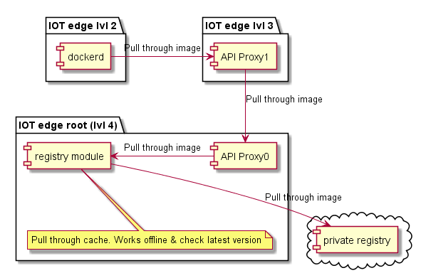
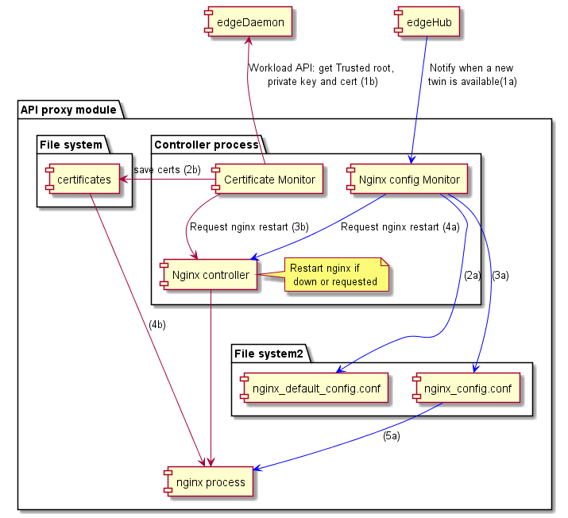
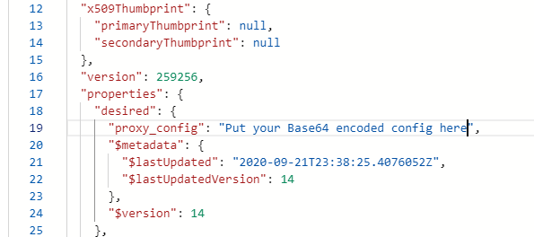

# API proxy module for nested IoT Edge in layered network (ISA-95)

When inside a layered network, IoT Edge doesn't have direct internet access. In that configuration, modules that attempt to reach out directly to a backend service in the Cloud will not be successful. The API proxy module can re-route these attempts to go through all the layers securely. It provides a secure way for clients to communicate to multiple services over HTTPs without tunneling, and instead by terminating the connections at each layer.

As an example, the API proxy module enables an IoT Edge device in a bottom layer of a layered network to download its container images from an [Azure Container Registry](https://azure.microsoft.com/en-us/services/container-registry/) via intermediate IoT Edge nodes. It also enables an IoT Edge device in a bottom layer of a layered network to upload blobs to an [Azure Blob Storage](https://azure.microsoft.com/en-us/services/storage/blobs/) with the [Azure Blob Store module](https://azuremarketplace.microsoft.com/en-us/marketplace/apps/azure-blob-storage.edge-azure-blob-storage?tab=Overview) via intermediate IoT Edge nodes.

## Concept

The API Proxy module is an [IoT Edge module](https://docs.microsoft.com/en-us/azure/iot-edge/iot-edge-modules) that leverages a [nginx](http://nginx.org/) reverse proxy to route data through network layers.
The diagram below illustrates this approach in the case of an IoT Edge device in a bottom layer that pulls container images from a container registry in the Cloud:



The configuration of the proxy rules defines how data is routed. Several configuration options are described in the [configuration section](#configure).

## Design

The *certificate path* is displayed *in red* below.

- (1b) check if current certificate is expired. If yes, get the certificate from the workload API.
- (2b) save certs on disk
- (3b) request a reload of nginx
- (4b) nginx reloads with new certs

The *configuration path* is displayed *in blue* below. It is possible to customize the API proxy configuration via its module twin.

- (1a) edgeHub notify a new twin is available
- (2a) configuration template is replaced
- (3a) configuration template is parsed and if successfull replaced on disk
- (4a) request to reload nginx
- (5a) nginx reloads with new config



## Build

1. Clone this repository

2. Build the module image by running the following command:

    ```cmd
    ./edge-modules/api-proxy-module/build.sh -t x86_64
    ```

    > To build an image for ARM, run the above command on a Linux ARM32 machine and change the -t switch to `armv7l`

3. Tag the image as desired and push it to the container registry used for your IoT Edge deployment.

## Configure

The configuration of the proxy embedded in the module defines which proxy rules are applied, which defines how data is routed. The configuration of the module image also needs to map the configuration of the proxy. For instance the module image should have the same listening port open as defined in the proxy.

### Configure the proxy

The configuration of the proxy is done via the following complementing mechanisms:

1. A default configuration file is embedded in the module
2. A new configuration can be passed down to the module from the cloud via its [module twin](https://docs.microsoft.com/en-us/azure/iot-hub/iot-hub-devguide-module-twins)
3. Environment variables can be passed down at deployment time to turn configuration settings on or off

### Understand the use of environment variables to edit a proxy configuration

Environment variables provide an easy way to turn settings on or off depending on the data that the API Proxy should route. The default proxy configuration implements the most commonly used features like downloading container images or uploading blobs that can turned on just by setting environment variables.

#### With the default proxy configuration

To edit the default proxy configuration with pre-defined settings, you need to:

1. Declare the environment variables, e.g. settings, that you want to edit in the `PROXY_CONFIG_ENV_VAR_LIST` environment variable.
2. Set values to these environment variables. For instance, set the `NGINX_HAS_BLOB_MODULE` to true to upload blobs to the cloud through the API Proxy module.

Note that environment variables can themselves be used to define the value of another environment variable (max 1 level of copy). This is makes the templating of the API proxy configuration easier. For instance:

- Environment variable `DOCKER_REQUEST_ROUTE_ADDRESS` is set to `${PARENT_HOSTNAME}` in the module settings
- Environment variable `PARENT_HOSTNAME` is set to `127.0.01` in the module settings
- When the API proxy configuration uses environment variable `DOCKER_REQUEST_ROUTE_ADDRESS`, it is automatically set to value `127.0.01`

#### With a custom proxy configuration

To write your own proxy configuration, you can also use environment variables to adjust settings for each deployment. This is done by using the following 2 syntax in the proxy configuration:

1. Use the `${MY_ENVIRONMENT_VARIABLE}` syntax to get environment variable's value.
2. Use the following conditional syntax to turn settings on or off:

```txt
#if_tag ${MY_ENVIRONMENT_VARIABLE}
    statement to execute if ${MY_ENVIRONMENT_VARIABLE}=1
#endif_tag ${MY_ENVIRONMENT_VARIABLE}

#if_tag !${MY_ENVIRONMENT_VARIABLE}
    statement to execute if ${MY_ENVIRONMENT_VARIABLE}=0
#endif_tag ${MY_ENVIRONMENT_VARIABLE}
```

When the API Proxy module parses a proxy configuration, it goes through the following 2 steps:

1. All environment variables contained in PROXY_CONFIG_ENV_VAR_LIST are replaced by their value using substitution
2. Everything that is between #if_tag 0 and #endif_tag 0 or between  #if_tag !1 and #endif_tag !1 is replaced.

The parsed configuration is then provided to the nginx reverse proxy.

### Use pre-defined environment variables to turn settings on or off

For easiness of use, the API proxy module comes with a default configuration that meets most frequent scenarios out-of-the-box and that is modular. That configuration is controlled through environment variables of the module.

First, list all the environment variables that you want to update in the `PROXY_CONFIG_ENV_VAR_LIST`. This step prevents from modifying configuration settings by mistake:

| Environment variable  | comments |
| ------------- |  ------------- |
| PROXY_CONFIG_ENV_VAR_LIST | List all the variable to be replaced. By default it contains: NGINX_DEFAULT_PORT,BLOB_UPLOAD_ROUTE_ADDRESS,DOCKER_REQUEST_ROUTE_ADDRESS,IOTEDGE_PARENTHOSTNAME  |

Next, set each environment variable's value by listing them directly.

| Environment variable  | comments |
| ------------- |  ------------- |
| NGINX_DEFAULT_PORT  | Changes the port Nginx listens too. If you change this option, make sure that the port you select is exposed in the dockerfile. Default is 443  |
| DOCKER_REQUEST_ROUTE_ADDRESS | Address to route docker requests. By default it points to the parent.  |
| BLOB_UPLOAD_ROUTE_ADDRESS| Address to route blob registry requests. By default it points to the parent. |
| IOTEDGE_PARENTHOSTNAME | Parent hostname |

### Update the proxy configuration dynamically

To update the proxy configuration dynamically:

1. Write your own configuration file. You can use this [default template](https://github.com/Azure/iotedge/blob/023c919d49f9de0feabf539ab7326f7cdcf7ccc9/edge-modules/api-proxy-module/templates/nginx_default_config.conf) as a starting point and the syntax described [above](#understand-the-use-of-environment-variables-to-edit-a-proxy-configuration).
2. Copy the text and convert it to base64
3. Paste it as the value of the `proxy_config` desired property of the module twin



### Update the default configuration

To update the default configuration when the module starts, replace the configuration file `edge-modules\api-proxy-module\templates\nginx_default_config.conf` and rebuild the API Proxy module image per the [build instructions](#build).

### Configure the module and the edge runtime

Lastly, the configuration of the module should match the configuration of the proxy. For instance, the module image should have the same listening port open as defined in the proxy.

To minimize the number of open ports, the API Proxy should relay all HTTPS traffic (e.g. port 443), including traffic targeting the edgeHub. To avoid port binding conflicts, the edgeHub settings thus needs to be modified to not port bind on port 443. The API Proxy module should bind its port 443. The API Proxy should also be configured to route the edgeHub traffic by turning on the `ROUTE_EDGEHUB_TRAFFIC` to true (see example below).

If minimizing the numer of open ports is not a concerned, the API Proxy can listen on another port than 443 and let edgeHub use port 443. The API Proxy can for instance listen on port 8000 by setting the environment variable `NGINX_DEFAULT_PORT` to `8000` and bind port 8000 of the API Proxy module. This is the default configuration of the API Proxy module.

## Configuration examples

### Download container images

This section describes how to use the API Proxy module to download container images across multiple IoT Edge nodes. It uses the [Docker registry module](https://hub.docker.com/_/registry) to retrieve container images from the cloud and cache them at the top layer, and the API Proxy to relay all HTTPS requests to download a container image from lower layers to be served by the Docker registry module in the top layer.

It assumes that a Docker registry module named `registry`has been deployed in topmost IoT Edge device and that the deployment manigest of all children devices in lower layers point at this local registry module.

The configuration of the API Proxy module at the **top layer** for this scenario is the following

- Environment variables:

    | Name  | Value |
    | ------------- |  ------------- |
    |DOCKER_REQUEST_ROUTE_ADDRESS|registry:5000|
    |NGINX_DEFAULT_PORT|8000|

- CreateOptions:

    ```json
    {
        "HostConfig": {
            "PortBindings": {
                "8000/tcp": [
                    {
                        "HostPort": "8000"
                    }
                ]
            }
        }
    }
    ```

The configuration of the API Proxy module at **any lower layer** for this scenario is the following:

- Environment variables:

    | Name  | Value |
    | ------------- |  ------------- |
    |NGINX_DEFAULT_PORT|8000|    

- CreateOptions:

    ```json
    {
        "HostConfig": {
            "PortBindings": {
                "8000/tcp": [
                    {
                        "HostPort": "8000"
                    }
                ]
            }
        }
    }
    ```

These settings are set by default when deploying from the [Azure Marketplace](http://aka.ms/iot-edge-marketplace).

Lastly, all the module image URIs in **any lower layer** should use the domain name `$upstream` followed by the API Proxy module port number such as `$upstream:8000/api-proxy-module:1.0` 

### Upload blob

This section describes how to use the [blob storage module](https://docs.microsoft.com/en-us/azure/iot-edge/how-to-deploy-blob) to [upload support bundle](https://github.com/Azure/iotedge/blob/master/doc/built-in-logs-pull.md). 
It assumes that the blob storage module has already been deployed. Please follow this [link](https://docs.microsoft.com/en-us/azure/iot-edge/how-to-deploy-blob) for detail on how to deploy it. 

>If you want to upload support bundle, currently, the only supported configuration is when the blob storage module is at the top level. To be able to upload a support bundle, a blob container needs to be created and as of now that is only possible when the blob storage module is at the top level.


The configuration of the API Proxy module at the **top layer** for this scenario is the following
It assumes that a Docker registry module named `AzureBlobStorageonIoTEdge` has been deployed

- Environment variables:

    | Name  | Value |
    | ------------- |  ------------- |
    |BLOB_UPLOAD_ROUTE_ADDRESS|AzureBlobStorageonIoTEdge:11002|
    |NGINX_DEFAULT_PORT|8000|

- CreateOptions:

    ```json
    {
        "HostConfig": {
            "PortBindings": {
                "8000/tcp": [
                    {
                        "HostPort": "8000"
                    }
                ]
            }
        }
    }
    ```

The configuration of the API Proxy module at **any lower layer** for this scenario is the following:

- Environment variables:

    | Name  | Value |
    | ------------- |  ------------- |
    |NGINX_DEFAULT_PORT|8000|    

- CreateOptions:

    ```json
    {
        "HostConfig": {
            "PortBindings": {
                "8000/tcp": [
                    {
                        "HostPort": "8000"
                    }
                ]
            }
        }
    }
    ```

These settings are set by default when deploying from the [Azure Marketplace](http://aka.ms/iot-edge-marketplace).

To upload the support bundle and/or log file to the blob module located at the root:
1. First create a blob container, you can use azure storage explorer for that or the rest APIs (the process is described [here](https://docs.microsoft.com/en-us/azure/iot-edge/how-to-store-data-blob))

2. follow the process described at this [link](https://github.com/Azure/iotedge/blob/master/doc/built-in-logs-pull.md) to request a log/bundle upload, but replace the address of the blob storage module by `$upstream`.
For example:  
***UploadSupportBundle***
```json
{    
    "schemaVersion": "1.0",
    "sasUrl": "https://$upstream:8000/myBlobStorageName/myContainerName?SAS_key",
    "since": "2d",
    "until": "1d",
    "edgeRuntimeOnly": false
}
```

