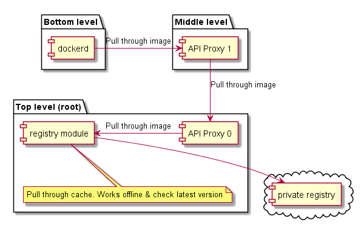
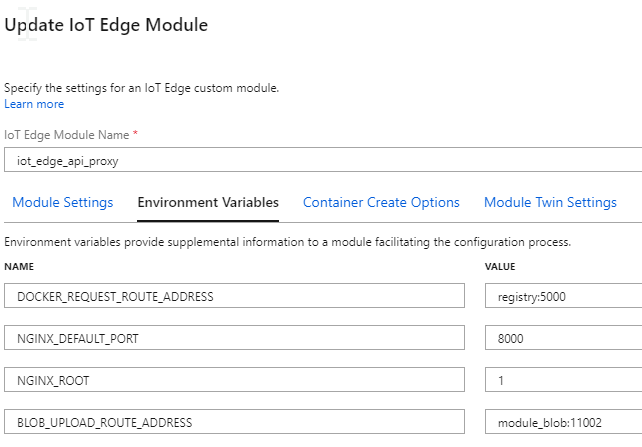
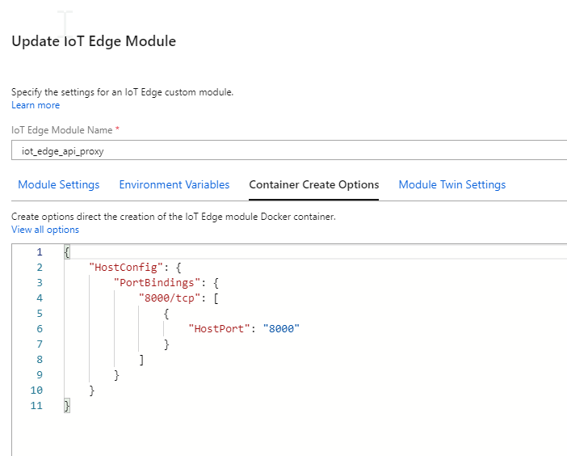
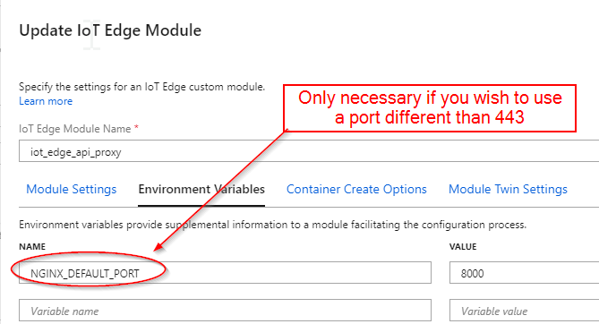
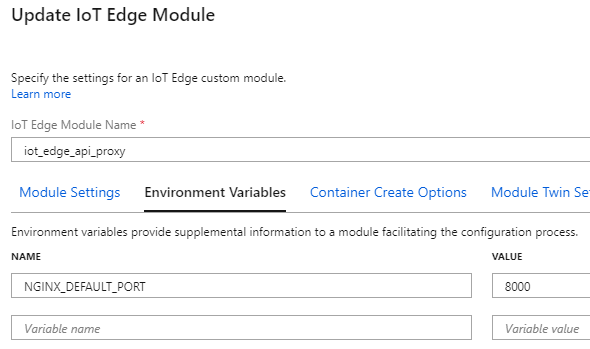
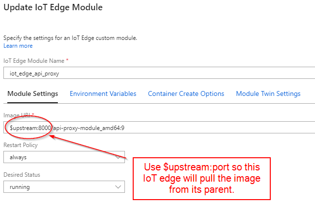
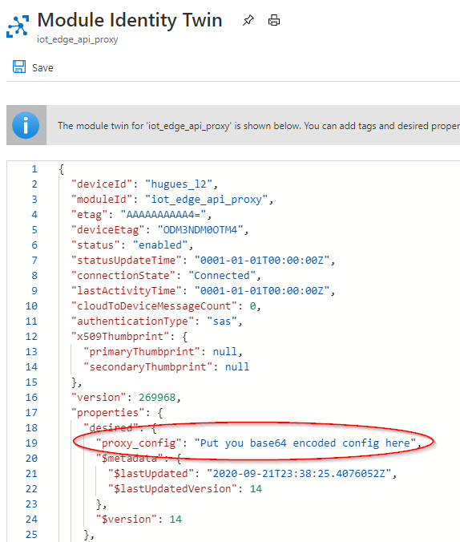

# API proxy module for nested IoT Edge in layered network (ISA-95)
When inside a layered network, IoT Edge doesn't have direct internet access. 
The API proxy module provides a way to maintain all the services an IoT Edge provide - inside a layered network - without tunneling and by terminating the connection at each layer

## Architecture
We leverage a [nginx](http://nginx.org/) reverse proxy IoT Edge module to route messages through the layers. The diagram below illustrates this approach: 



## Design

In blue: The configuration path. It is possible to customize the API proxy configuration via Twin.
- 1a: edgeHub notify a new twin is available
- 2a: configuration template is replaced
- 3a: configuration template is parsed and if successfull replaced on disk
- 4a: request to reload nginx
- 5a: nginx reloads with new config

In red: The certificate path
- 1b: check if current certificate is expired. If yes, get the certificate from the workload API.
- 2b: save certs on disk
- 3b: request a reload of nginx
- 4b: nginx reloads with new certs


## Setup instructions 
### Build the api-proxy-module image
1. Clone this repository.

2. Build the image by running the following command:

    ```
    $ ./edge-modules/api-proxy-module/build.sh -t x86_64
    ```

    > To build an image for ARM, run the above command on a Linux ARM32 machine and change the -t switch to `armv7l`

3. Tag the image as desired and push to the container registry used for your IoT Edge deployment.

### Setup the proxy module
To avoid creating a full proxy configuration from scratch, the API proxy module provide a modular default configuration.
That configuration is controlled through the environment variables of the container

| Environment variable  | comments |
| ------------- |  ------------- |
| NGINX_DEFAULT_PORT  | Changes the port Nginx listens too. If you change this option, make sure that the port you select is exposed in the dockerfile. Default is 443  |
| DOCKER_REQUEST_ROUTE_ADDRESS | Address to route docker request. By default it points to the parent.  |
| PROXY_CONFIG_ENV_VAR_LIST | List all the variable to be replace. By default it contains: NGINX_DEFAULT_PORT,NGINX_HAS_BLOB_MODULE,NGINX_BLOB_MODULE_NAME_ADDRESS,DOCKER_REQUEST_ROUTE_ADDRESS,NGINX_NOT_ROOT,PARENT_HOSTNAME  |

### How it works
When the application boots up, it does two things:
* It sets a value to all the env var that have default value (see above)
* It dereferences all every environment variable that point to another environment variable. It is possible to set 1 level of indirection. 
```
For example:
The environment variable DOCKER_REQUEST_ROUTE_ADDRESS = "${PARENT_HOSTNAME}"
With PARENT_HOSTNAME="127.0.0.1"
After calling we want DOCKER_REQUEST_ROUTE_ADDRESS="127.0.0.1"
```

The template sent through the twin is received by the application and parsed.
The parsing goes through 2 steps:
* All environment variables contained in PROXY_CONFIG_ENV_VAR_LIST are replaced by their value using subst
* Everything that is between #if_tag 0 and #endif_tag 0 or between  #if_tag !1 and #endif_tag !1 is replaced.
It is possible to configure some kind of "conditional configuration"
```
For example:
The environment variable REMOVE_BETWEEN1 = 0
The environment variable REMOVE_BETWEEN2 = 1

A configuration like this:
{
    #if_tag ${REMOVE_BETWEEN1}
        will be removed
    #endif_tag ${REMOVE_BETWEEN1}

    #if_tag !${REMOVE_BETWEEN1}
        will be NOT be removed: REMOVE_BETWEEN1
    #endif_tag ${REMOVE_BETWEEN1}

    #if_tag ${REMOVE_BETWEEN2}
        will be NOT be removed: REMOVE_BETWEEN2
    #endif_tag ${REMOVE_BETWEEN2}

    #if_tag !${REMOVE_BETWEEN2}
        will be removed: REMOVE_BETWEEN2
    #endif_tag ${REMOVE_BETWEEN2}
}
Result after parsing
{
    #if_tag 0
    #endif_tag 0

    #if_tag !0
        will be NOT be removed: REMOVE_BETWEEN1
    #endif_tag 0

    #if_tag 1
        will be NOT be removed: REMOVE_BETWEEN2
    #endif_tag 1

    #if_tag !1
    #endif_tag 1
}

```


### Example of setup to pull container images & upload blob when modules

This section describe a possible configuration that uses the docker registry module (https://hub.docker.com/_/registry) and azure blob storage (https://docs.microsoft.com/en-us/azure/iot-edge/how-to-deploy-blob) to Download images and upload data.  

We distinguish two kinds of configuration:
#### Modules located at the root
Make sure to remove port 443 that is opened by edgehub or use another port that is available on the image.

| *Environment variables for root IoT edge* |
|:--:|
|  | 
 
| *Port bindings for root IoT edge* |
|:--:|
|  | 

| *Environment variables for below root IoT edge* |
|:--:|
|  | 
 
| *Port bindings for below root IoT edge* |
|:--:|
|  | 

| *Image selection for below root IoT edge* |
|:--:|
|  | 

# Replacing completely the API-proxy-module configuration
The template provided is mainly for prototyping and ease of use. More avdanced applications will need more customization options. To that effect, it is possible to:
1. Replace the default configuration in real time:  
    a. Create your own configuration  
    b. Copy the text and convert it to base64  
    c. Past it as a desired property inside the API-PROXY twin:

  

2. Replace the default configuration when nginx starts up:
This is possile by generating a new API proxy image and replacing the configuration: edge-modules\api-proxy-module\templates\nginx_default_config.conf