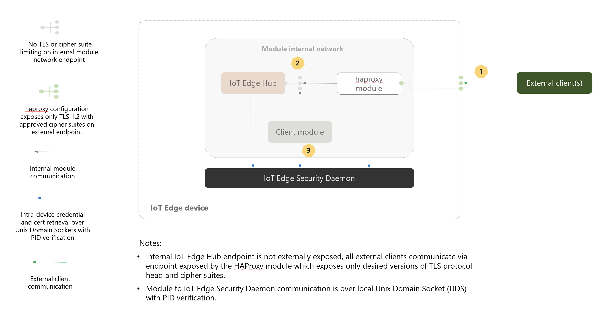

# Control TLS version and ciphers exposed by IoT Edge Hub
IoT Edge Hub can be configurated to expose endpoints on an IoT Edge device to allow downstream clients to connect to IoT Hub via the edge device. For improved security, customers might want to limit the version of TLS as well as cipher suites supported by these edge device endpoints. Below, we describe an architecture to enable this.

## Architecture
We leverage a [haproxy](http://www.haproxy.org) reverse proxy IoT Edge module to limit TLS versions and cipher suites supported by the external facing endpoints on the IoT Edge device. The diagram below illustrates this approach: 


## Setup instructions 

### Build the edgehub-proxy image

1. Clone this repository.

2. Modify **/edge-modules/edgehub-proxy/haproxy.cfg** with desired configuration and save the file. Values to set:

    | Setting      | Value                                                                                                                                                                                                                                                                                              |
    |--------------|----------------------------------------------------------------------------------------------------------------------------------------------------------------------------------------------------------------------------------------------------------------------------------------------|
    | TLS          | Modify the `ssl-default-bind-options` entry.<br>[Full list of options](https://www.haproxy.com/documentation/aloha/9-5/traffic-management/lb-layer7/tls/#define-bind-directives-on-the-frontend).<br><br>*Use `ssl-default-bind-options no-sslv3 no-tlsv10 no-tlsv11` to expose only TLS v1.2* |   |
    | Cipher suite | Modify the `ssl-default-bind-ciphers` entry.<br>[Full list of options](https://www.haproxy.com/documentation/aloha/9-5/traffic-management/lb-layer7/tls/#define-tls-settings-in-the-global-section).                                                                                            |

3. Build the image by running the following command:

    ```
    $ ./edge-modules/edgehub-proxy/build.sh -i eh-proxy -t x86_64
    ```

    > To build an image for ARM, run the above command on a Linux ARM32 machine and change the -t switch to `armv7l`

4. Tag the image as desired and push to the container registry used for your IoT Edge deployment.

### Add proxy to IoT Edge deployment

1. Remove the entire **PortBindings** section from the **HostConfig** section of IoT Edge Hub's Container Create Options.

1. Add the previously built proxy module to the deployment, with the following Container Create Options:

    ```
    {
        "HostConfig": {
            "PortBindings": {
                "443/tcp": [
                    {
                        "HostPort": "443"
                    }
                ],
                "5671/tcp": [
                    {
                        "HostPort": "5671"
                    }
                ],
                "8883/tcp": [
                    {
                        "HostPort": "8883"
                    }
                ]
            }
        }
    }
    ```

## Testing

You can use the `openssl s_client` command to test TLS versions and cipher suites exposed by the IoT Edge device (via the proxy module). [Here](https://www.feistyduck.com/library/openssl-cookbook/online/ch-testing-with-openssl.html#testing-protocol-support) is an example.
