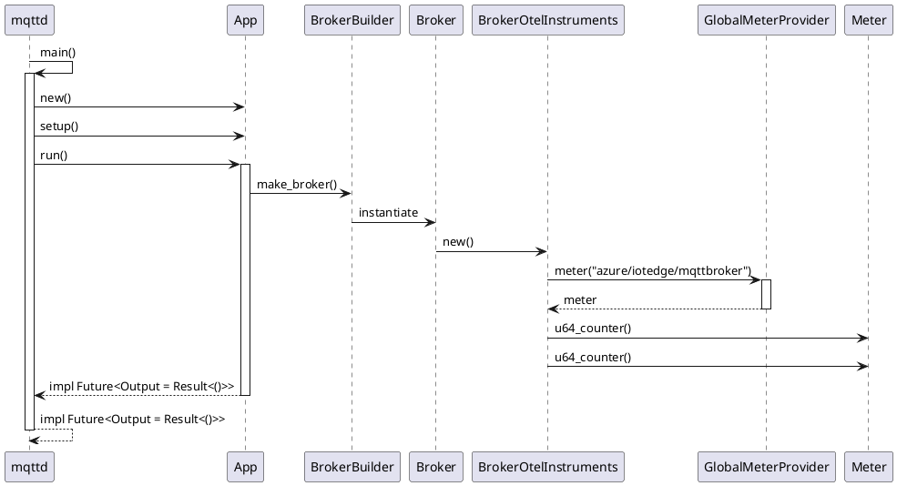
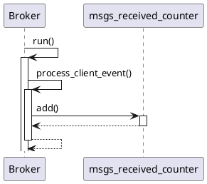

# Broker Metrics

## Initialization

```plantuml
@startuml sequence
participant mqttd
participant App
participant BrokerBuilder
participant Broker
participant BrokerOtelInstruments
participant GlobalMeterProvider
participant Meter

mqttd -> mqttd : main()
activate mqttd
mqttd -> App : new()
mqttd -> App : setup()
mqttd -> App : run()
activate App
App -> BrokerBuilder : make_broker()
BrokerBuilder -> Broker : instantiate
Broker -> BrokerOtelInstruments : new()
BrokerOtelInstruments -> GlobalMeterProvider : meter("azure/iotedge/mqttbroker")
activate GlobalMeterProvider
return meter
BrokerOtelInstruments -> Meter : u64_counter()
BrokerOtelInstruments -> Meter : u64_counter()
return impl Future<Output = Result<()>>
return impl Future<Output = Result<()>>
@enduml
```

## Instrumentation Example

```plantuml
@startuml sequence
participant Broker
participant msgs_received_counter as counter
Broker -> Broker : run()
activate Broker
Broker -> Broker : process_client_event()
activate Broker
Broker -> counter : add()
activate counter
return
return
@enduml
```
