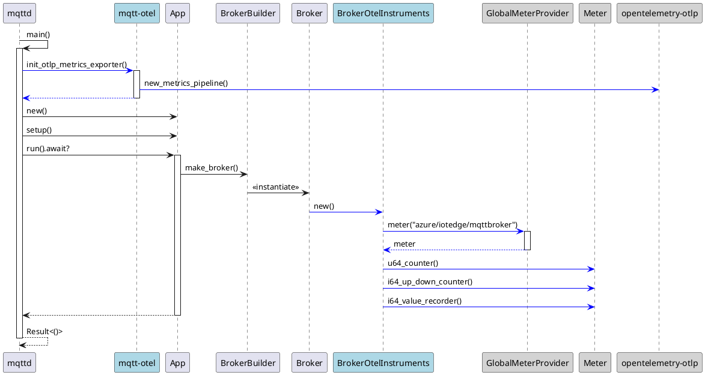
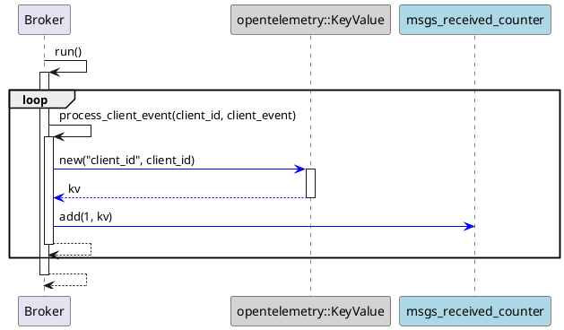

# Broker Metrics

## Initialization

```plantuml
@startuml sequence
participant mqttd
participant "mqtt-otel" as mqttotel #lightblue
participant App
participant BrokerBuilder
participant Broker
participant BrokerOtelInstruments #lightblue
participant GlobalMeterProvider #lightgrey
participant Meter #lightgrey
participant "opentelemetry-otlp" as otlpExport #lightgrey

mqttd -> mqttd : main()
activate mqttd
mqttd -[#blue]> mqttotel : init_otlp_metrics_exporter()
activate mqttotel
mqttotel -[#blue]> otlpExport : new_metrics_pipeline()
return
mqttd -> App : new()
mqttd -> App : setup()
mqttd -> App : run().await?
activate App
App -> BrokerBuilder : make_broker()
BrokerBuilder -> Broker : << instantiate >>
Broker -[#blue]> BrokerOtelInstruments : new()
BrokerOtelInstruments -[#blue]> GlobalMeterProvider : meter("azure/iotedge/mqttbroker")
activate GlobalMeterProvider
return meter

BrokerOtelInstruments -[#blue]> Meter : u64_counter()
BrokerOtelInstruments -[#blue]> Meter : i64_up_down_counter()
BrokerOtelInstruments -[#blue]> Meter : i64_value_recorder()
return
return Result<()>
@enduml
```

## Measurement Example

```plantuml
@startuml sequence
participant Broker
participant "opentelemetry::KeyValue" as kv #lightgrey
participant msgs_received_counter as counter #lightblue
Broker -> Broker : run()
activate Broker
loop
Broker -> Broker : process_client_event(client_id, client_event)
activate Broker
Broker -[#blue]> kv : new("client_id", client_id)
activate kv
return kv
Broker -[#blue]> counter : add(1, kv)
return
end
return
@enduml
```
