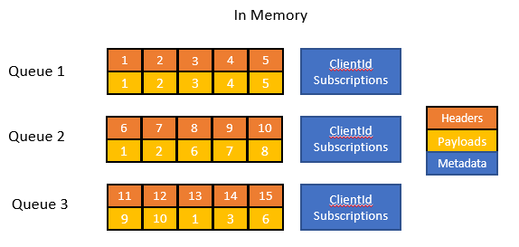
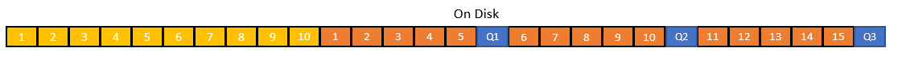

# Broker Persistance
The broker's persistance strategy is simple. It has 3 triggers: 
* Configurable Timer
* Shutdown
* User triggered event ([SIGUSR1](http://man7.org/linux/man-pages/man7/signal.7.html))

Whenever persistance is triggered, the entire state is saved to a single file as described below.

## Requirements
* Minimize space used on disk
* If a valid state exists, memory constraints must not prevent it from being loaded
* Write overhead is small

## Strategy
### Persist
The broker first copies its state into a new representative object. It then consolidates all payloads in to a hashmap, replacing the payload with a reference id in the state. This removes duplicate payloads that are created when two or more devices are subscribed to the same topic. It also removes all transient data, such as currently in-flight messages and in-use packet identifiers.

This new structure is then converted to a binary stream. This stream is passed to the GZip algorithm and the resulting compressed binary is written directly to disk. This file is called a snapshot.

If this is the first time persisting the state, a symlink is creating pointing to the new snapshot. If there is already a snapshot existing, the symlink is moved from the old snapshot's file to the new snapshot's file. This ensures the file the symlink points to is always valid, even if the broker unexpectedly shuts down while writing to disk.

Once the symlink is moved, if there are more snapshots than the configured value (*link to config instructions here*) (default 2, min 1) the oldest snapshots will be deleted.
 

### Load
On start, the broker checks if a symlink points to a snapshot. If so, it loads and decompresses the binary representation of the snapshot. 

After the consolidated state has been loaded, the broker uses the hashmap of ids to payloads to re-add the payloads to messages.