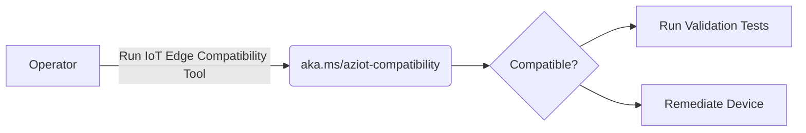
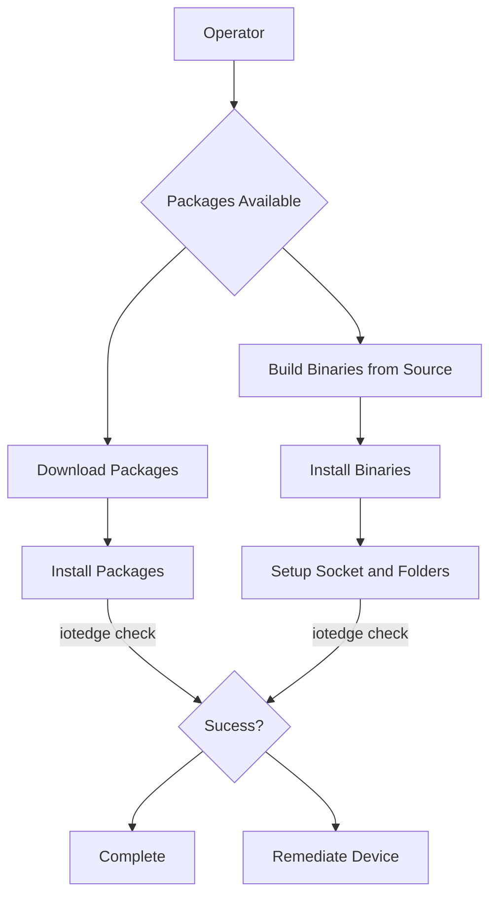
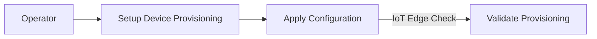

## *Platform Validation Toolkit*

The document describes the checks run by IoT Edge Platform Compatibility Toolkit in 3 different stages

### *Compatibility Stage*



These are checks that would run as part of [Azure IoT Compatibility Script](https://github.com/Azure/iotedge/blob/main/platform-validation/scripts/aziot-compatibility.sh) to determine whether or not IoT Edge can run on the device

Example Usage
```sh
wget aka.ms/aziot-compat.sh | sh
```
1. Check if CGroups Heirarchy is present - IMPLEMENTED
2. Check if Required Kernel Configuration for Running IoT Edge is Present - IMPLEMENTED
3. Check if systemd is present - IMPLEMENTED
4. Check if Architecture is supported - IMPLEMENTED
5. Check if Docker API Version is supported - IMPLEMENTED
6. Check if Shared Library Dependencies are met - IMPLEMENTED
7. Check if enough Memory is available on the device to run iot edge with minimal workload - IMPLEMENTED
8. Check if enough storage space is available on the device to run iot edge with minimal workload - IMPLEMENTED
9. Ensure that we can create a docker network(If Docker is present) - NOT IMPLEMENTED

### *Installation/Pre-Provisioning Stage*



These are checks that would run after a user has installed/upgraded iot edge binaries/package on the device. 


```sh
iotedge check --validate-install
```

1. Do I/O Read Write Operation : These Tests would involve exercising std::fs functions
An example could be std::fs::create_dir
2. Open/Close Sockets: IoT Edge and Identity Service both create sockets for communication. This test ensures that we can use the same libraries to open/close sockets
3. CURL calls to workload/management/identity/keyd/certd sockets to ensure they respond. Is there a generic call we can make to the sockets?
4. Exercise sysinfo crate function calls to make sure they work: eg.- sysinfo::set_open_files_limit()
5. Ensure that folders required by the IoT Edge daemon exists and have the required permissions. For eg: /var/lib/aziot/edged needs to exist and should be owned by iotedge user and have 755 ownership
6. Ensure that we can use openssl crates used in iotedge to generate x509 certs


### Upgrade Scenario
When a customer has already provisioned the device and simply upgrading iot edge to a newer version, The flow should run compatibility checks for the new release along with validation checks from the new release. More in this later.

### *Provisioning Stage*


These are checks that would run after the user has setup device provisioning information in config.toml 

1. If PKCS#11 Path Provided, verify if PKCS#11 Path configured properly.(Open Question , Do we require external tools for this?)
2. If Edge-CA Cerficicates and Key Provided, Ensure CA-Cert dir is owned by aziotcs and Key is owned by aziotks
3. If Device Identity Cert is Provided and is a file, Ensure that file is owned by aziotcs
4. If Device Identity Private Key is provided and is a file, Ensure that private key is owned by aziotks
3. Ensure Docker Logs are Available via iotedge logs edgeAgent
4. TPM Related Checks. If TPM is enabled, ensure that Kernel version > 4.12 since tpmr0 does not exist before that. Any additional requirements?