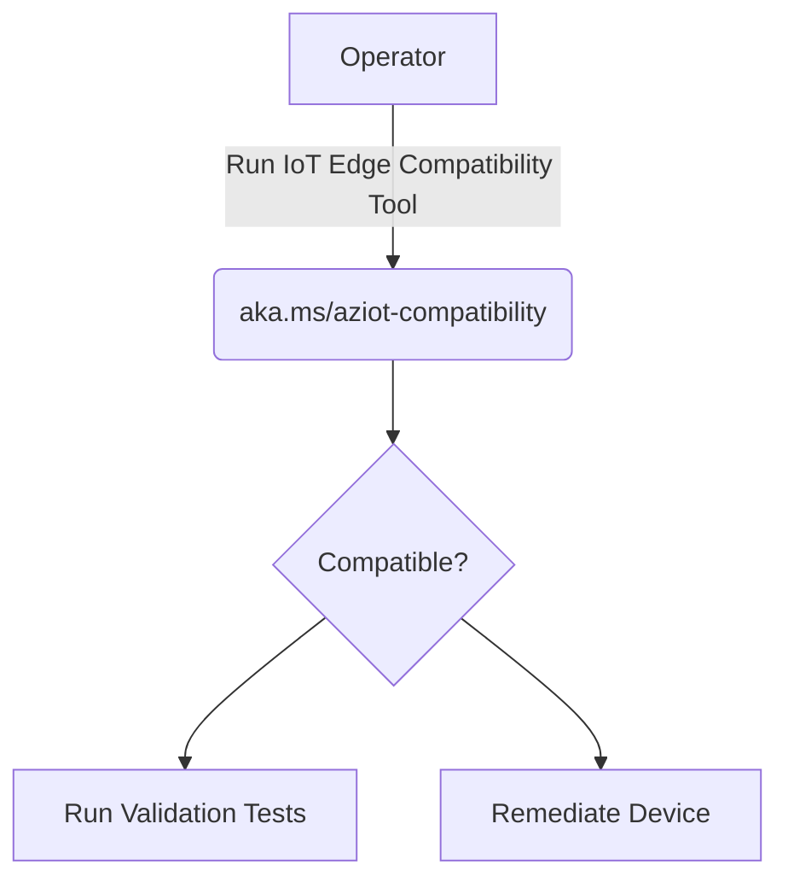
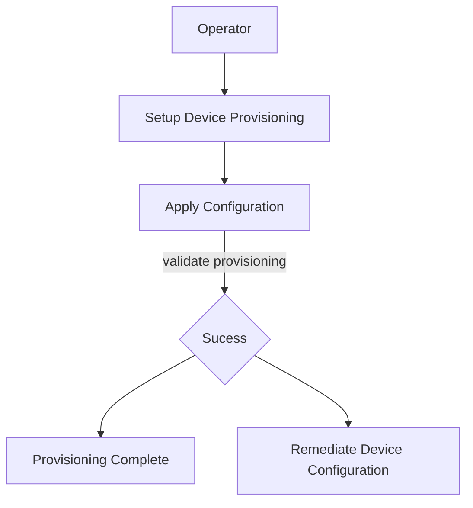
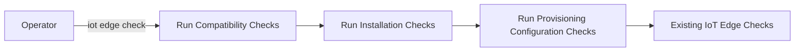

## *Platform Validation Toolkit*

Goal: To provide an enhanced and independent experience for customers to build, debug and install IoT Edge components on their device

The Validation Toolkit targets 3 stages and aims to build tooling to enhance debugging and installation experience in these 3 stages.

1. Pre-Installation Stage
2. Installation/Pre-Provisioning Stage
3. Post-Provisioning Stage

Each of these 3 stages are described in detail below

### *Compatibility/Pre-Installation Stage*
This is the stage where a customer is evaluating whether IoT Edge component can run on their device. 



These are checks that would run as part of [Azure IoT Compatibility Script](https://github.com/Azure/iotedge/blob/main/platform-validation/scripts/aziot-compatibility.sh) to determine whether or not IoT Edge can run on the device. The tool would output the errors and warnings, if any and steps on performing remediation. For example - On a missing kernel configuration, the tool would recommend rebuilding the kernel with the kernel configuration flag set. 

Example Usage
```sh
wget aka.ms/aziot-compat.sh | sh
```
1. Check if CGroups Heirarchy is present 
CGroups Heirarchy are required for running a container engine to allow cpu and memory resources.
Check Type :  Fail on Missing CGroup Heirarchy
Remediation : Use CGroup Mounts on the device (Example : https://github.com/tianon/cgroupfs-mount) 


2. Check if Required Kernel Configuration for Running IoT Edge is Present
Kernel Configurations that allow a container engine to run along with ensuring that Edge Containers can Bind to specific network ports
Check Type: Fail on Missing Kernel Configuration
Remediation: This requires rebuilding the kernel from the 

3. Check if systemd is present
Checks presence of systemd. On Absence, provides instructions on running iot edge without systemd
Check Type: Warning only

4. Check if Architecture is supported
Checks If the Architecture of the device is supported by IoT Edge. For eg: Currently ARMV6 is unsupported due to missing support for .NET Core 3.1
Check Type : Fail on Incompatible Architecture
Remediation : Requires Change of Hardware

5. Check if Docker API Version is supported
Checks if Docker API Version on the device matches the minimum Docker API Version as defined in our [codebase](https://github.com/Azure/iotedge/blob/main/edgelet/docker-rs/src/apis/configuration.rs#L14)
Check Type: Warning if Docker is missing from the device, Failure if Docker API Version on the device is lower than required version
Remediation: Provide Link to install/update Docker API

6. Check if Shared Library Dependencies are met
Checks if Shared Library dependencies (Eg: libssl,libcrypto) are present on the device
Check Type : Fails on Missing Libraries
Remediation : Dependent Libraries that are missing need to be installed for that distro

7. Check if enough Memory is available on the device to run iot edge with minimal workload
We calculate our average memory and cpu usage for each of our supported architectures by running iot edge with a minimal workload and then come up with an approximate memory usage. The memory usage is checked against available free memory on the device
Check Type: Gives a warning if there is insufficient memory on the device
Remediation: Free up memory on the device

8. Check if enough storage space is available on the device to run iot edge with minimal workload
We calculate the storage space required by iot edge binaries and edge runtime containers with a minimal workload and then come up with an approximate storage space required by IoT Edge Runtime. The storage space requiement is checked against available free space on the device.
Check Type:  Gives a warning if there is insufficient storage space on the device
Remediation: Free up space on the device

9. Ensure that we can create a docker network(If Docker is present)

### *Installation/Pre-Provisioning Stage*


Once the customer has verified that their device is compatible, the next stage is the installation phase
We currently publish packages for a wide variety of OS and Architecture [Flavors](https://github.com/Azure/azure-iotedge/releases). There maybe certain situations where we do not support the packaging format and/or don't have known support for the OS(eg. Some custom Yocto Distro). In those scenarios, We provide instructions to build binaries from source as well as running them [here](https://github.com/Azure/iotedge/blob/main/edgelet/doc/devguide.md).

After the binaries have been deployed to the device (Either via a package installation or via manually), How does a customer ensure that iot edge works correctly?
The solution is to expand the capabilities of IoT Edge check to better test Device level interaction and provide better insights into any problems that may arise between interaction of Hardware/OS Layer with IoT Edge Binaries.

This document provides some additional checks that we intend to implement as part of testing Hardware/OS Level Interaction. 

An example command could be
```sh
iotedge check --validate-install
```
List of Proposed Checks for Validating Install are:

1. Do I/O Read Write Operation : These Tests would involve exercising std::fs functions
An example could be std::fs::create_dir
2. Open/Close Sockets: IoT Edge and Identity Service both create sockets for communication. This test ensures that we can use the same libraries to open/close sockets
3. CURL calls to workload/management/identity/keyd/certd sockets to ensure they respond. Is there a generic call we can make to the sockets?
4. Exercise sysinfo crate function calls to make sure they work: eg.- sysinfo::set_open_files_limit()
5. Ensure that folders required by the IoT Edge daemon exists and have the required permissions. For eg: /var/lib/aziot/edged needs to exist and should be owned by iotedge user and have 755 ownership
6. Ensure that we can use openssl crates used in iotedge to generate x509 certs

### *Provisioning Stage*


Once it has been verified that installation is sucessfull and the device is ready to be provisioned by one of the many methods provided [here](aka.ms/iotedge), The next question is how does a customer know that the provisioning succeeded? 

The current IoT Edge checks do a good job of checking connectivity at both host and container level(A Complete list of checks can be found by calling iotedge check --list). Although they provide guidance on what went wrong, this document proposes adding additional checks to ensure that some of the user configuration steps have take place correctly. 

An example command could be
```sh
iotedge check --provisioning
```
List of Proposed Checks for Validating Provisioning are:

1. If PKCS#11 Path Provided, verify if PKCS#11 Path configured properly.(Open Question , Do we require external tools for this?)
2. If Edge-CA Cerficicates and Key Provided, Ensure CA-Cert dir is owned by aziotcs and Key is owned by aziotks
3. If Device Identity Cert is Provided and is a file, Ensure that file is owned by aziotcs
4. If Device Identity Private Key is provided and is a file, Ensure that private key is owned by aziotks
3. Ensure Docker Logs are Available via iotedge logs edgeAgent
4. TPM Related Checks. If TPM is enabled, ensure that Kernel version > 4.12 since tpmr0 does not exist before that. Any additional requirements?
5. If TPM is enabled, Ensure IoT Edge has access to TPM as illustrated [here](https://docs.microsoft.com/en-us/azure/iot-edge/how-to-provision-devices-at-scale-linux-tpm?view=iotedge-2020-11&tabs=physical-device%2Cubuntu) 


### *New IoT Edge Check Flow*
As can be seen above, IoT Edge Check would now be adding checks for validating installation as well as customer provisioning information. If a generic `iotedge check` command is run on a system, Then an example flow is


As with the current implementation of iotedge check, customers would have an option to skip certain checks as needed.

### *Upgrade Scenario*
When a customer has already provisioned the device and simply upgrading iot edge to a newer version, The flow should run compatibility checks for the new release along with validation checks from the new release.


