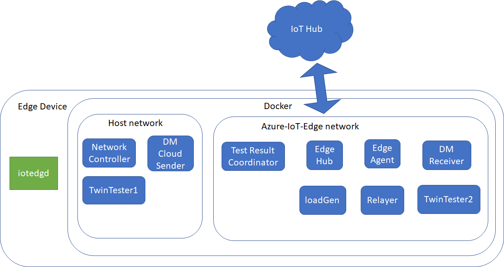
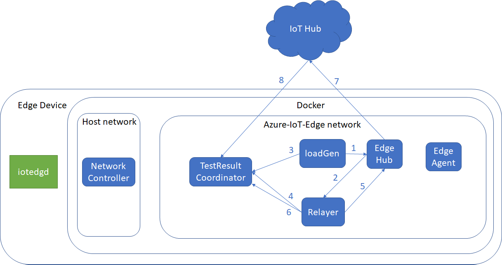
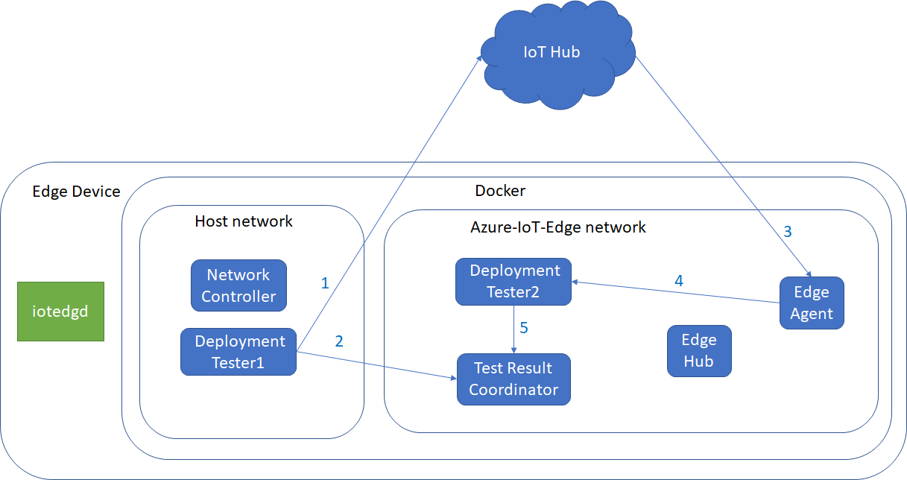
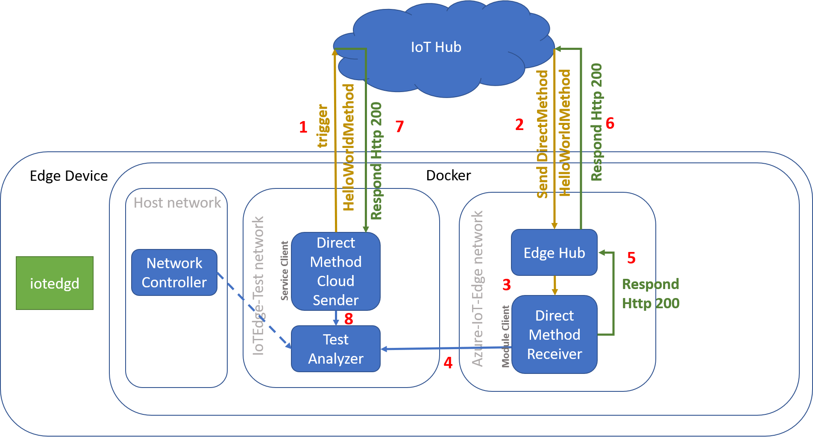
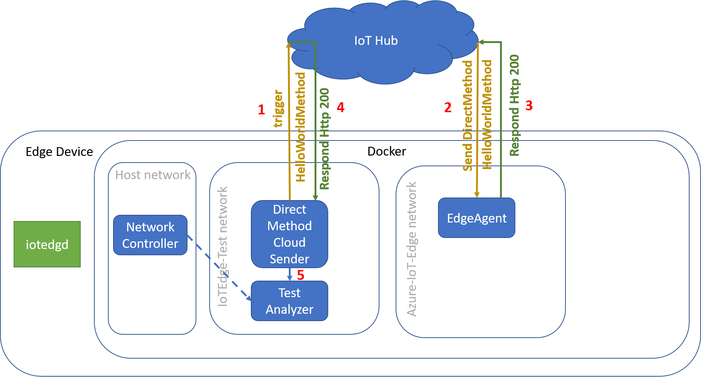
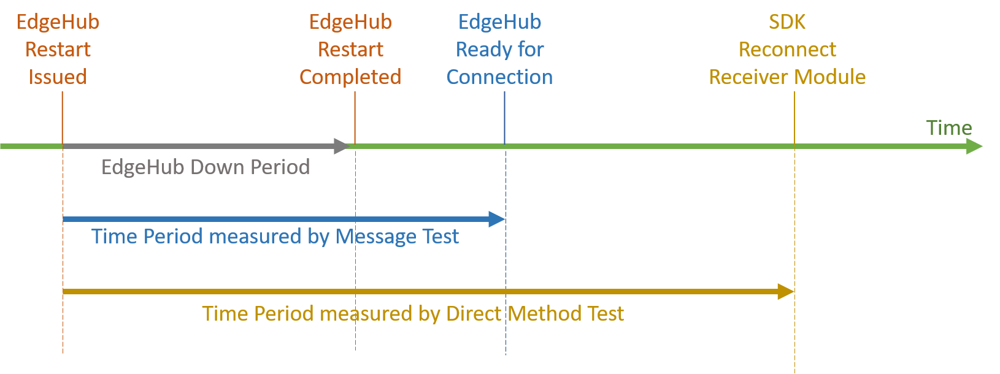
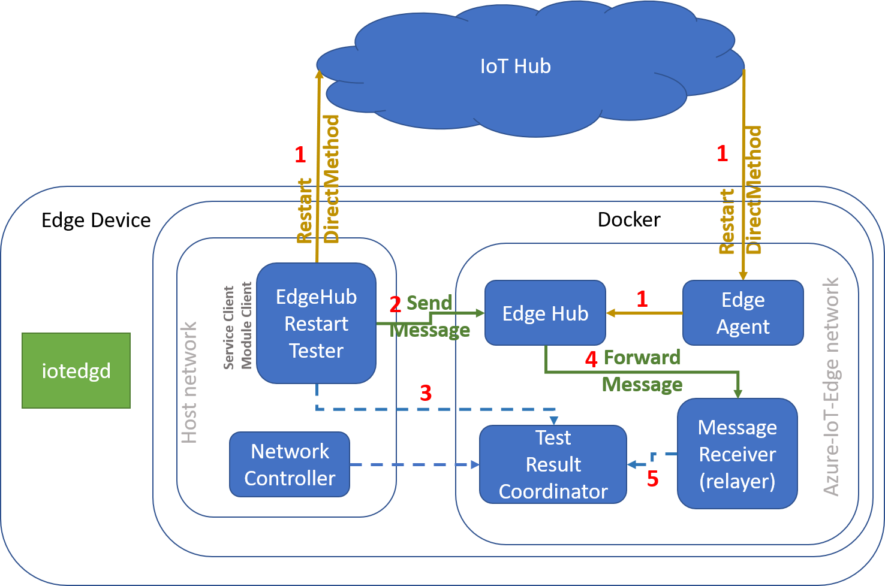

 Connectivity tests

### Test Scenarios
These are test scenarios to be covered in Connectivity test

1. Messaging Test
   1. Module-to-Module
   2. Module-to-IoT Hub
2. Twin Property Update Test
   1. Desired property
   2. Reported property
3. Direct Method Test
   1. Cloud-to-module
   2. Ping method in EdgeAgent
4. EdgeAgent Deployment Test
   1. Deployment change
5. EdgeHub Restart Test
   1. Message Test
   2. Direct Method Test

### General flow
1. Currently Connectivity test is supported only to run on Linux AMD64.
2. Connectivity test can be run by calling [Connectivity Test script](https://github.com/Azure/iotedge/blob/master/test/connectivity/scripts/connectivityTest.sh).
3. Each test runs using AMQP and MQTT TCP protocol.
4. For each run, a new tracking id (Guid) is generated by the test script.
5. Test starts after pre-defined warm-up period (default 2 minutes), which assumes EdgeHub and other modules containers are up and running.
6. A test duration is configurable and is set to 1 hour by default.
7. A test module is responsible for providing the _Test Result Coordinator_ with a result of its operation.
8. An operation result is persistently stored by the _Test Result Coordinator_ after validating result type is supported.
9. The _Test Result Coordinator_ consumes events from IoT hub's built-in event hub endpoint for messaging scenario verification.
10. The _Network Controller_ simulates a different test network condition, e.g. offline or packet loss. The _Network Controller_, like any other test modules, is responsible to report a result of its action to The _Test Result Coordinator_.
11. After the test duration is over, the test waits for a brief period of time to ensure that all of the actions propagated through the system. Then, the final test report is generated and uploaded to Log Analytics. The buffer is 15 minutes by default, which assumes all messages are received on _IoT hub_ and are pulled for verification.
12. After test duration, test modules should stop calling operations, e.g. sending messages, making Direct method calls, etc.

### Offline Scenario
1. The _Network Controller_ controls the virtual network "Azure-IoT-Edge" to simulate offline and packet-loss scenarios.
2. When generating test result reports, network status is taken into consideration based on result reported by _Network controller_.

### Potential Issues
1. If there are many tests running at the same time using devices in the same _IoT hub_, there may be too many event messages received by _Test Result Coordinator_; which slows down test result verification and may cause failed result.
   1. Try to reduce number of test devices in a test IoT hub.
   2. Introduce _Azure Stream Analytics (ASA)_ to process messages, which should provide a higher throughput.
2. _Network Controller_ implementation may support on Linux only, but not Windows platform.

### Tests

#### Messaging Test

##### Test Specific Components:
1. _Message Sender (loadGen)_ is a module client that is deployed into a test agent as a container module. The responsibility of the module is to send a message to another module along with reporting to _Test Result Coordinator_ once a message is sent. 
2. _Message Receiver (Relayer)_ is a module client that is a receiver of the message sending from the _Message Sender_. Once the message is received, the _Message Receiver_ notifies the _Test Result Coordinator_ regarding the message arrival.

##### Test Mechanism: 
1. _loadGen_ starts sending messages after pre-defined warm-up period.
2. _loadGen_ sends module-to-module messages to _Relayer_ through Edge hub (#1 -> Edge hub -> #2).
3. After sending each message, _loadGen_ reports result to _Test Result Coordinator_ (#3).
4. _Relayer_ receives the message and reports result to _Test Result Coordinator_ (#2 -> #4).
5. After receiving in _Relayer_, messages send forward to _IoT hub_ through _Edge hub_ (#5 -> Edge hub -> #7).
6. After forwading each message in _Relayer_, it reports result to _Test Result Coordinator_ (#6).
7. All messages should contain tracking id, batch id and sequence number.  Sequence number should always start at 1 in _loadGen_.

Network offline/online should not affect this test result since _Edge hub_ stores all messages when offline and resumes back once get back online.

#### Deployment Update Test

1. _DeploymentTester1_ is in host network, while _DeploymentTester2_ is in Azure-IoT-Edge docker network.
2. _DeploymentTester1_ starts updating target module _(DeploymentTester2)_ deployment by adding new environment variables after pre-defined warm-up period.
3. _DeploymentTester1_ sends updated deployment of _DeploymentTester2_ to IoT hub (#1).
4. After updating target module deployment, _DeploymentTester1_ will report result to _Test Result Coordinator_ (#2).
5. _Edge Agent_ will get updated deployment of target module from IoT hub (#3); and deploy module with updated environment variables (#4).
6. When _DeploymentTester2_ starts up, it will get all environment variables and report to _Test Result Coordinator_ (#5).

When network goes offline, route#3 will not happen.  But once the network comes back online, _Edge Agent_ should be able to get the latest updated deployment and deploy _DeploymentTester2_.

#### Cloud to Module Direct Method Test

The Direct Method Connectivity Test is designed to test direct method resilience against network connectivity issue. 
##### Test Specific Component:
1. _Direct Method (Cloud) Sender_ is an Azure service client that is wrapped in a container module that is deployed into a test agent.  It is responsible for sending a "HelloWorldMethod" direct method to the _Direct Method Receiver_ module and report the direct method status to _Test Result Coordinator_.
2. _Direct Method Receiver_ is a module container that runs a module client that is deployed into a test agent. It is a targeted receiver of _Direct Method Sender_. It is responsible for replying to the "HelloWorldMethod" direct method and notify _Test Result Coordinate_ if it receives a direct method.

##### Test Mechanism: 
1. The _Direct Method (Cloud) Sender_ invokes a test direct method to the _IoT Hub_.
2. The _IoT Hub_ forwards the direct method to _Edge Hub_.
3. The _Edge Hub_ forwards the direct method to _Direct Method Receiver_.
4. The _Direct Method Receiver_ notifies _Test Result Coordinator_ regarding the received direct method.
5. The _Direct Method Receiver_ responds to _Edge Hub_'s direct method invocation.
6. The _Edge Hub_ responds to _IoT Hub_ direct method invocation.
7. The _Direct Method (Cloud) Sender_ receives a response from _IoT Hub_.
8. The _Direct Method (Cloud) Sender_ notifies _Test Result Coordinator_ regarding its direct method response.
9. Test _Result Coordinator_ compiles a report from _Direct Method (Cloud) Sender_, _Direct Method Receiver_, _Network Controller_ and determine if the test case is passed or failed. 

##### Passing Criteria: 
We have 8 different cases that we account for in the Cloud to Module Direct Method (DM) tests. The tolerance period is defined as the amount of time we have deemed acceptable between when we begin toggling the network controller off and the network actually turning off. The tolerance period is set in the connectivity deployment, currently under e2e-deployment-files as connectivity_deployment.template.json.

The 8 cases are as follows with descriptions of what they mean:
| Name | Description |
|------|-------------|
| NetworkOnSuccess | Network was on at the time that the DM was sent, and the DM went through successfully. This is the network on happy case. |
| NetworkOffSuccess | Network was off at the time that the DM was sent, and the DM failed. This is the expected case while the network is off. |
| NetworkOnToleratedSuccess | Network was on at the time that the DM was sent, the DM was sent during the tolerance period, and the DM failed. This is considered a success because the DM failed during network on only within the tolerance period. |
| NetworkOffToleratedSuccess | Network was off at the time that the DM was sent, the DM was sent during the tolerance period, and the DM succeeds. This is considered a success because the DM succeeds during network off only within the tolerance period. |
| NetworkOnFailure | Network was on at the time that the DM was sent, the DM was sent after the tolerance period, and the DM failed. This is considered a failure because we expect the DM to succeed. The whole test will fail if this count is > 0. |
| NetworkOffFailure | Network was off at the time that the DM was sent, the DM was sent after the tolerance period, and the DM succeeds. This is considered a failure because we expect the DM to fail. The whole test will fail if this count is > 0. |
| MismatchSuccess | DM call succeeded, but there was no report received from the receiver. This can happen if we send a successful DM, but as soon as its sent through the network goes off and the receiver can't send a report to the TRC. |
| MismatchFailure | There was a report from the receiver but not from the sender. This should never happen and is considered a failure if the count is > 0. |

#### Cloud to EdgeAgent Direct Method Test (PING)

##### Test Specific Component:
1. _Direct Method (Cloud) Sender_ is an Azure service client that is wrapped in a container module that is deployed into a test agent.  It is responsible for sending a "HelloWorldMethod" direct method to the EdgeAgent module and report the direct method status to _Test Result Coordinator_.

##### Test Mechanism: 
1. The _Direct Method Cloud Sender_ invokes a test direct method to the _IoT Hub_.
2. The _IoT Hub_ forwards the direct method to _Edge Agent_.
3. The _Edge Agent_ has a pre-implemented "ping" method with a response.
4. The _Direct Method Cloud Sender_ receives a response from _IoT Hub_.
5. The _Direct Method Cloud Sender_ notifies _Test Result Coordinator_ regarding its direct method response.
6. _Test Result Coordinator_ compiles a report from _Direct Method Cloud Sender_, _Direct Method Receiver_, _Network Controller_ and determine if the test case is passed or failed. 

##### Passing Criteria: 
We have 6 different cases that we account for in the edgeAgent Direct Method (DM) ping tests. The tolerance period is defined as the amount of time we have deemed acceptable between when we begin toggling the network controller off and the network actually turning off. The tolerance period is set in the connectivity deployment, currently under e2e-deployment-files as connectivity_deployment.template.json.

The 6 cases are as follows with descriptions of what they mean:
| Name | Description |
|------|-------------|
| NetworkOnSuccess | Network was on at the time that the DM was sent, and the DM went through successfully. This is the network on happy case. |
| NetworkOffSuccess | Network was off at the time that the DM was sent, and the DM failed. This is the expected case while the network is off. |
| NetworkOnToleratedSuccess | Network was on at the time that the DM was sent, the DM was sent during the tolerance period, and the DM failed. This is considered a success because the DM failed during network on only within the tolerance period. |
| NetworkOffToleratedSuccess | Network was off at the time that the DM was sent, the DM was sent during the tolerance period, and the DM succeeds. This is considered a success because the DM succeeds during network off only within the tolerance period. |
| NetworkOnFailure | Network was on at the time that the DM was sent, the DM was sent after the tolerance period, and the DM failed. This is considered a failure because we expect the DM to succeed. The whole test will fail if this count is > 0. |
| NetworkOffFailure | Network was off at the time that the DM was sent, the DM was sent after the tolerance period, and the DM succeeds. This is considered a failure because we expect the DM to fail. The whole test will fail if this count is > 0. |

#### Cloud to Device Message Test

The goal of the test scheme is to verify the recoverability of the cloud to device messaging once the device goes offline. 
##### Test Specific Components:
1. _Message Sender_ is an Azure service client that is deployed into a test agent as a container module. The responsibility of the module is to use the Azure API to trigger _IoT Hub_ to send a message to device along with reporting to _Test Result Coordinator_ once a message is sent. 
2. _Message Receiver_ is a device client that is wrapped in a module container for a deployment into a test agent. The device module behaves as a target receiver of the message sending from _Message (Cloud) Sender_ and is responsible for reporting to the _Test Result Coordinator_ once a message is received.

##### Test Implementation Assumption:
1. The cloud takes less than 15 minutes to forward all of messages from the cloud to device when the _Edge Hub_ is online.
2. Each cycle of _Network Controller_ online-offline period must be longer than the _Edge Hub_ recovering period.
3. Since the _Message Sender_ uses service client to send a message to the cloud from the host network, it will always report success even if the message has yet gotten to the _Message Receiver_. If the _Message Sender_ fails to send a message, the message sequencing ID should NOT be increased; instead, a failed message with the same sequence number should be resent.
	a. Implementation Note: The sequence number is not increased in case of failure makes the verification process easier by solely verify the message sequence number is sequential.
	b. Implementation Note: Generally if there is a failure (or an exception) from message sending, the error information is logged in the _Message Sender_ log.
	
##### Test Mechanism: 
1. The _Message Sender_ invokes the _IoT Hub_ to send a message to a targeted device.
2. The _Message Sender_ notify the _Test Result Coordinator_ that a message has been sent.
3. The _IoT Hub_ sends a message to _Edge Hub_ addressing a targeted device.
4. The _Edge Hub_ forward the message to a _Message Receiver_ device module.
5. The _Message Receiver_ notifies that the message successfully received to the _Test Result Coordinator_.
6. The _Message Receiver_ replies that the message successfully received to the _Edge Hub_.
7. The _Edge Hub_ forward the _Message Receiver_'s response back to _IoT Hub_.
8. The _IoT Hub_ forward the response to _Message Sender_.

##### Passing Criteria: 
All the messages sent by _Message Sender_ is received in order at _Message Receiver_ within (EdgeHub_Recover_Time) + 15 minutes.
Where (EdgeHub_Recover_Time) is the time span _EdgeHub_ takes to be aware of online/offline state

#### EdgeHub Restart Test
The goal of _EdgeHub Restart Test_ is to verify/benchmark a restart period of an _EdgeHub_. The measurement is done using two methods: a Direct Method and a Message.

The message test is developed to strictly test only when the _EdgeHub_ complete its restart and is ready for a module to connect.  While the direct method test also make sure that the receiver can successfully response to the direct method request from the sender. This results in a slightly different time measurement between the two test (see the diagram below).

##### EdgeHub Restart Test : Message Test

###### Test Specific Components:
1. _EdgeHub Restart Tester (EHRT)_ has two responsibility including
	a. Restart EdgeHub - The EHRT sends a direct method via service client to edgeAgent informing that edgeHub needs to be restart.
	b. Send a message via EdgeHub - The EHRT will attempt to send message via EdgeHub to the Message Receiver (relayer) once the restart direct method is successfully issued.
	Note: EHRT and EdgeAgent are deployed in Host Network scope because it is crucial to test that the Restart Direct Method to always succeed via IoTHub even in the offline scenario.
2. _Message Receiver_ is a target for EHRT to send a message. Once the message is received in the Message Receiver, it will forward the message to _Test Result Coordinator_ for a verification.

###### Test Mechanism: 
1. The _EdgeHub Restart Tester_ issues a direct method to _EdgeAgent_ notifying the _EdgeAgent_ to restart _EdgeHub_ module.
2. Once the restart direct method response with a success, the _EdgeHub Restart Tester_ attempts to send a message to _Message Receiver_ via _EdgeHub_. 
	a. The SDK will throw an exception within _EdgeHub Restart Tester_ if the _EdgeHub_ is unabled to be connected
	b. If the SDK stops throwing an exception and respond with HTTP OK, it is an indicator that the sender module is able to communicate with _EdgeHub_. However, this does not imply that the _EdgeHub_ can successfully send the message to the _Message Receiver_.
3. The _EdgeHub Restart Tester_ reports its related results to the _Test Result Coordinator_.
4. Eventually the _EdgeHub_ will forward the message to the _Message Receiver_ once the receiver module can successfully reconnected to the _EdgeHub_.
5. Once the receiver module receives a message, it will report the message receival to _Test Result Coordinator_.

###### Passing Criteria:
1. The _EdgeHub_ module can successfully be restarted by the _EdgeHub Restart Tester_.
2. The _EdgeHub Restart Tester_ can successfully send a message to _Edge Hub_ within the configured restart period.
3. The _Message Receiver_ receives a message from _EdgeHub Restart Tester_ that is routed via _EdgeHub_ within a reasonable timely fashion.

##### EdgeHub Restart Test : Direct Method Test

###### Test Specific Components:
1. _EdgeHub Restart Tester (EHRT)_ has two responsibility including
	a. _Restart EdgeHub_ - The _EHRT_ sends a direct method via service client to _edgeAgent_ informing that _edgeHub_ needs to be restart.
	b. Send a direct method via EdgeHub - The _EHRT_ will attempt to send direct method (via _EdgeHub_) to the _Direct Method Receiver_ once the restart direct method is successfully issued.
	Note: EHRT and _EdgeAgent_ are deployed in Host Network scope because it is crucial to test that the Restart direct method to always succeed via _IoTHub_ even in the offline scenario. 
2. _Direct Method Receiver_ is a target for _EHRT_ to send a direct method. Once the _Direct Method_ is received, the _Receiver_ immediately report the direct method receival to _Test Result Coordinator_ for a verification.

###### Test Mechanism: 
1. The _EdgeHub Restart Tester_ issues a direct method to _EdgeAgent_ notifying the _EdgeAgent_ to restart _EdgeHub_ module.
2. Once the restart direct method response with a success, the _EdgeHub Restart Tester_ attempts to send a direct method to the _Direct Method Receiver_. 
	a. The SDK will throw an exception within _EdgeHub Restart Tester_ if the _EdgeHub_ is unabled to be connected OR the receiver module is unabled to be connected.
	b. If the SDK stops throwing an exception and respond with HTTP OK, it is an indicator that the _EdgeHub Restarter Tester_ module is able to communicate with _Direct Method Receiver_ successfully. This ensures by the SDK that the _Direct Method Receiver_ received the direct method.
3. Upon the receival of the direct method, the _Direct Method Receiver_ sends a result to the _Test Result Coordinator_.
4. After the _Direct Method Receiver_ responses, the _EdgeHub Restart Tester_ sends the response result to the _Test Result Coordinator_.

###### Passing Criteria:
1. The _EdgeHub_ module can successfully be restarted by the _EdgeHub Restart Tester_.
2. The _EdgeHub Restart Tester_ can successfully send a direct method to _Direct Method Receiver_ within the configured restart period.