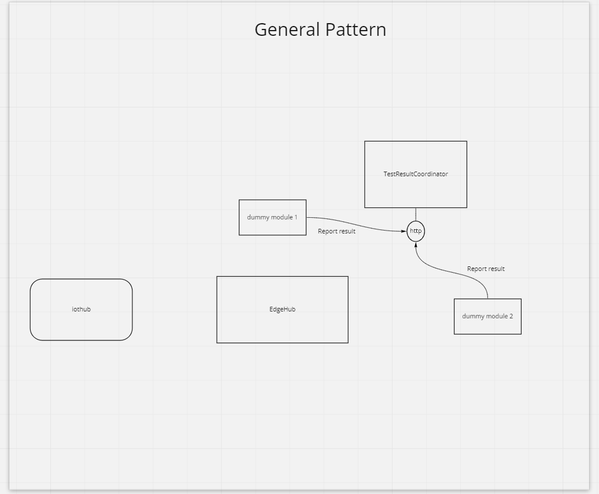
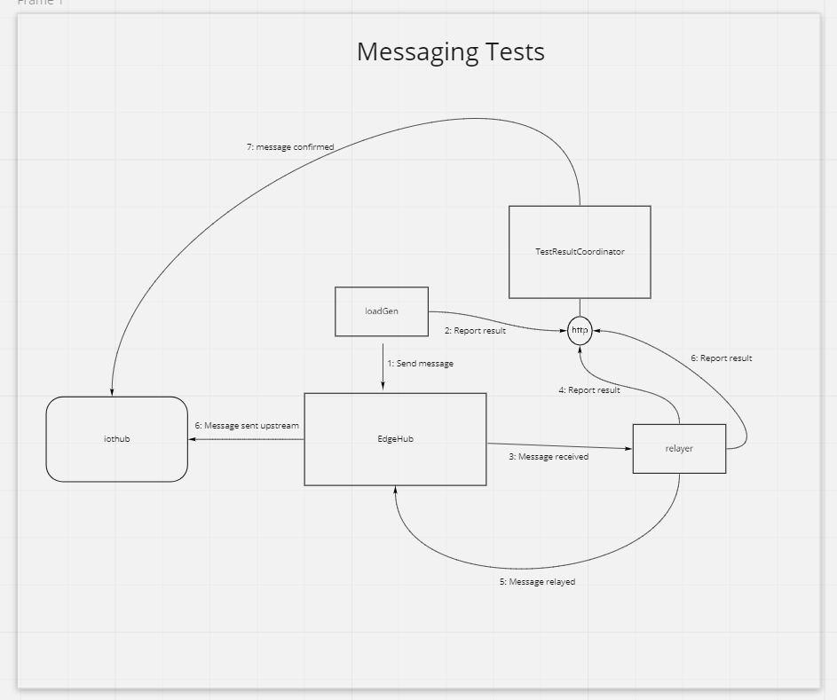
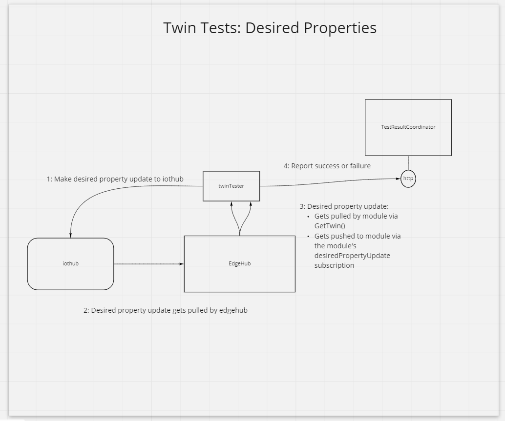
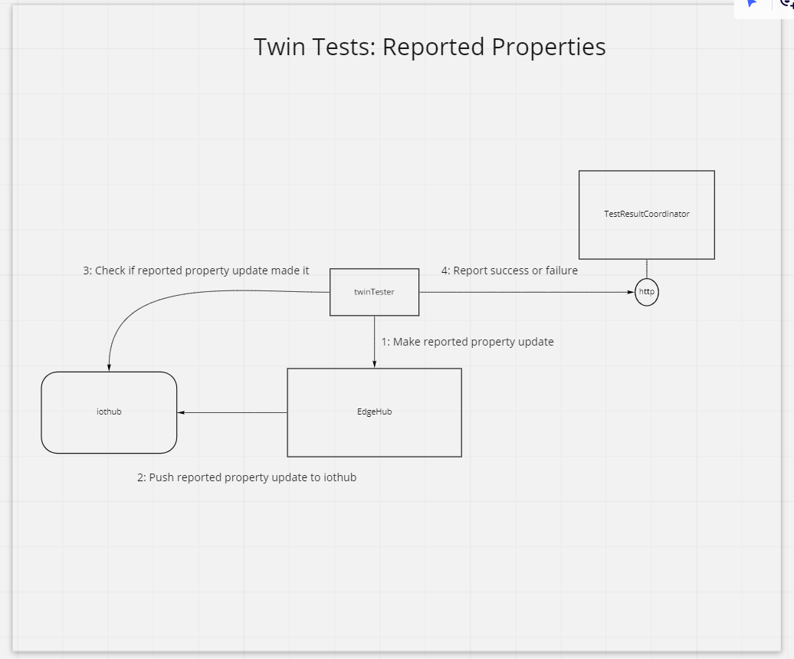
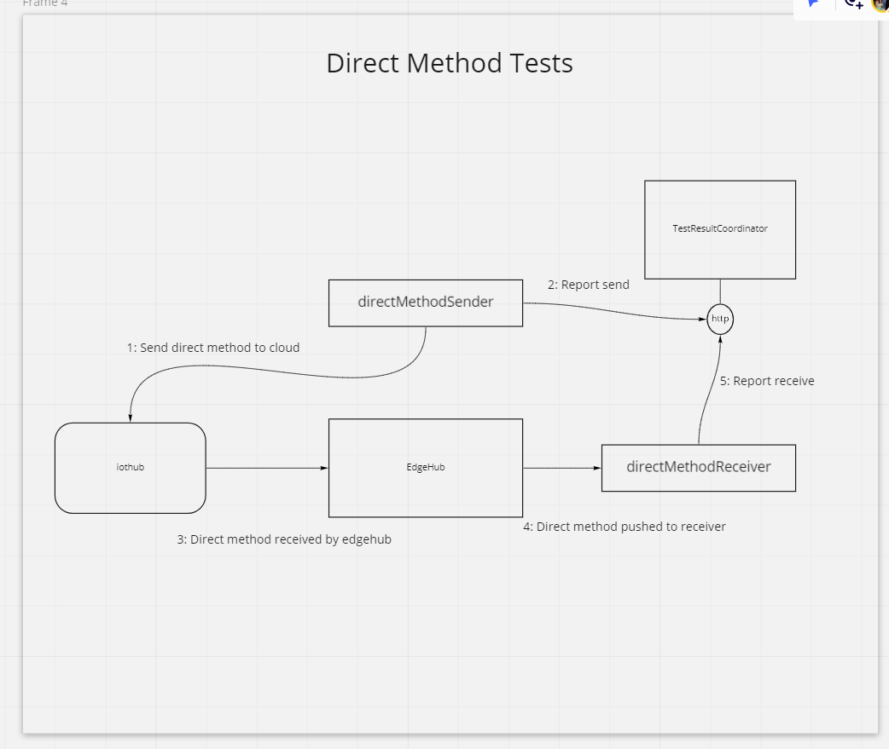
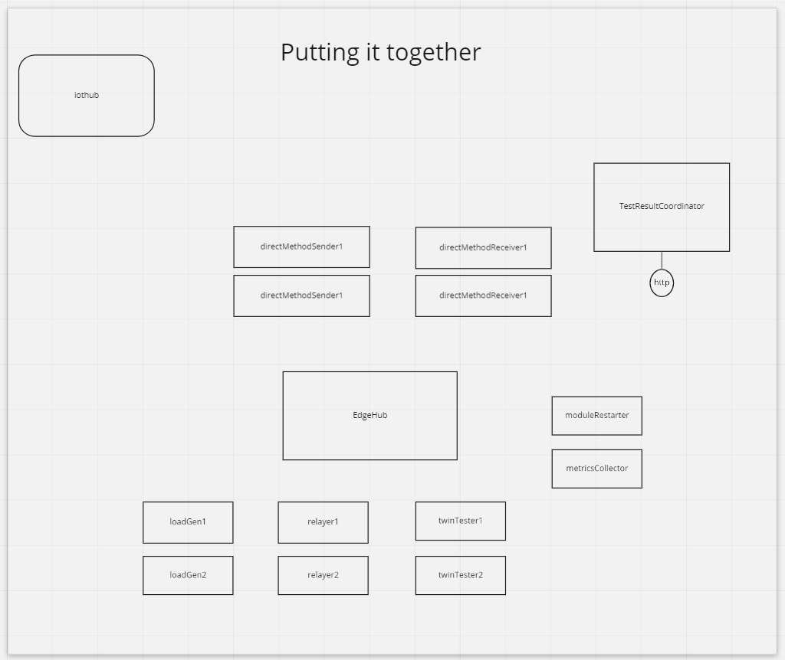

# Longhaul Tests

## Test Scenarios
Longhaul tests have the goal of successfully operating all the edge primitives at once. These are test scenarios to be covered in Longhaul test

1. Messaging Test
   1. Module-to-Module
   2. Module-to-IoT Hub
2. Twin Property Update Test
   1. Desired property
   2. Reported property
3. Direct Method Test
   1. Cloud-to-module

Below I have diagramed some of the specific scenarios.

## General Scenario
The general scenario is that one deploys an edge instance with the TestResultCoordinator (TRC) and some amount of test modules. The test modules will take some action and report to the TRC that it happened. The TRC then uses all the context from the reports to generate a success or failure from that test run.

## Messaging Test

## Twin Test
Twin tests for longhaul do additional validation on the module side, breaking the pattern slightly for where TRC does 100% the validation. They do this validation in two indpendent pathways which happen concurrently and allow for multiple concurrent in-flight updates.

Desired Properties Pathway:

Reported Properties Pathway:

## Direct Method Test

## All

Putting it together, lots happens at once. We will have all these tests going at once for two client protocols (amqp and mqtt).

